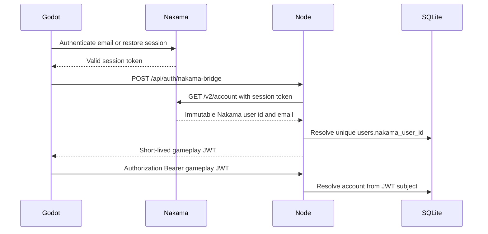
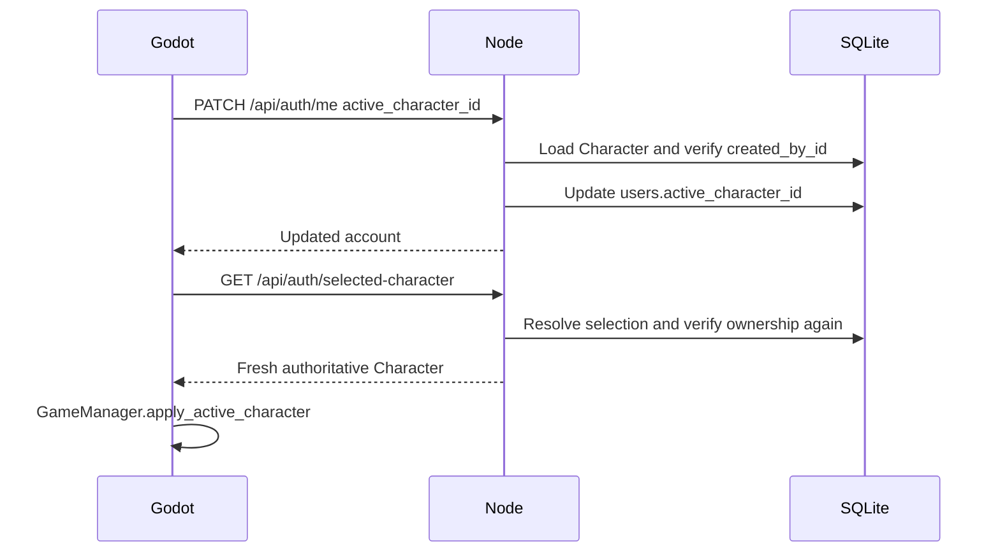

# Authentication and Character foundation

## Ownership

- Nakama owns email authentication, immutable user identity, and session lifecycle.
- Node maps that identity to one Loot & Lasers account and owns all gameplay.
- Godot is the GDScript client. It stores no authoritative account, Character,
  inventory, currency, reward, combat, or progression state.

Existing Nakama gameplay RPCs are legacy restoration debt. They are not part of
the target authentication flow and must not be expanded.

## Authentication sequence

The gameplay JWT:

- is stateless and normally valid for 12 minutes;
- never expires after the Nakama session;
- uses the immutable Nakama user id as `sub`;
- includes issuer, gameplay audience, `iat`, `exp`, and unique `jti`;
- is proactively re-exchanged by Godot 90 seconds before expiry;
- can only be re-exchanged with a valid Nakama session.

No Nakama password is sent to Node. Legacy Node password routes remain isolated
for compatibility and do not issue Godot gameplay tokens.

## Account mapping

`users.nakama_user_id` is a unique partial index. Bridge resolution is:

1. Existing exact Nakama user mapping.
2. Existing unlinked Node account with the validated Nakama email (legacy adoption).
3. New bridge-only Node account with an unknown random Node password.

Concurrent first exchanges converge on the same Node row. Startup fails with a
diagnostic if an old database already contains duplicate non-empty mappings; it
does not silently merge player accounts.

## Character loading sequence

Selection is account-global: the last successful selection wins across devices.
Nakama profile `selected_character_id` is retained for rollback but ignored by
the foundation. Boot does not consult Nakama mission state.

## Character creation

Godot supplies name, race, class, appearance, and a stable `request_id`. Node:

- forces `created_by_id` from the authenticated mapped account;
- validates the class and server-authors stats, progression, Fuel, Stardust, and Nova;
- enforces Character-slot limits;
- records `(account_id, request_id)` plus a request fingerprint;
- returns the same Character on an identical replay;
- rejects reuse of the key with different input;
- selects the first Character in the same SQLite transaction.

The current first-Character Nova value remains 100; later Characters start at 0.

## Read and ownership security

Character, Item, Mission, and other Character-owned entity reads are intersected
with the authenticated account on Node. Direct foreign GETs and filters fail or
return no records. Client-supplied account, owner, or Character ids never establish
identity or ownership.

Character bootstrap exceptions are limited to listing owned Characters, creating
within the account slot limit, and selecting an owned Character.

## Session restoration and logout

Nakama sessions and Node gameplay JWTs are environment-scoped. A restored Node
token is accepted only when its saved Nakama subject matches the current Nakama
session and it is not near expiry.

An authenticated Node request that returns 401 triggers one single re-exchange and
one retry. There is no retry loop and no Node refresh token or token database.

Logout clears Nakama and Node credentials, active Character, wallet, inventory,
equipment, stats, missions, shop, Arena, progression, dungeon, notifications,
social/chat/mail caches, presence, and realtime transports.

Staging never falls back to localhost. If the shared Node API is unavailable,
Godot retains a still-valid Nakama session and reports a retryable gameplay-link
failure instead of opening a different SQLite database.

## Deployment

The Node container requires:

- `JWT_SECRET`
- `GAMEPLAY_JWT_TTL_SEC` (default `720`, capped at `900`)
- `GAMEPLAY_JWT_ISSUER`
- `GAMEPLAY_JWT_AUDIENCE`
- `NAKAMA_HTTP_URL`

`docker-compose.node-api.yml` maps `host.docker.internal` to the Linux host gateway
so a co-located Nakama on port 7350 can be validated. Port 8787 must be reachable
from staging clients, or an HTTPS reverse proxy on 443 must forward to it.

Back up the `node_api_data` SQLite volume before first deployment because startup
adds the unique mapping index and Character-creation receipt table.

## Verification

- `node scripts/verify_nakama_node_bridge.mjs`
- `npm run test:godot-auth-flow`
- `npm run test:api`
- `npm run verify:backend`
- Godot: `--headless -s res://_audit_all.gd`
- Godot local integration: `--headless --path loot&lasers res://Scripts/test_auth_foundation.tscn`

Staging end-to-end verification remains blocked until the Hetzner Node endpoint is
deployed and externally reachable.
