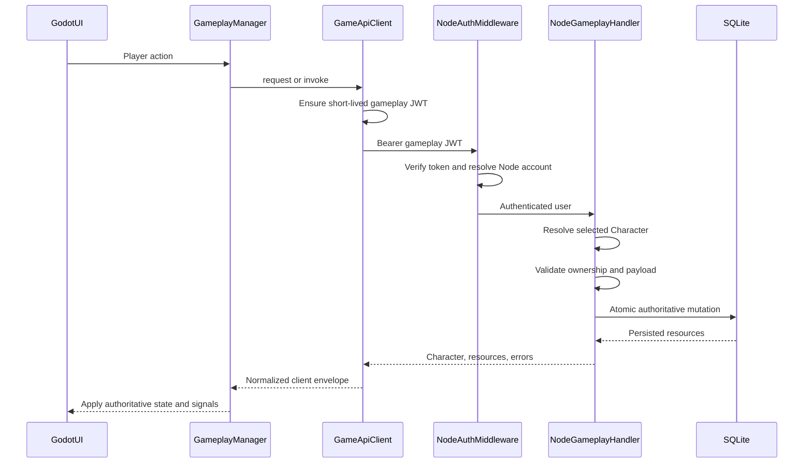

# Gameplay request pipeline audit

Status: Milestone 0 baseline, 2026-08-03.

## Governing boundary

Loot & Lasers has one gameplay authority:

- Nakama owns authentication, account identity, session creation, validation,
  lifecycle, and the existing realtime transport.
- Godot owns presentation, input, networking, animation, and temporary UI state.
- Node owns gameplay validation, selected-character ownership, persistence,
  progression, inventory, equipment, economy, missions, combat, shops, mining,
  dungeons, Arena, rewards, statistics, and achievements.

The working Windows release pipeline, public Hetzner routing, TLS, environment
selection, Nakama-to-Node token exchange, account mapping, and character loading
are protected production infrastructure. Restoration phases must not redesign
them.

## Existing authoritative request pipeline



### Godot transport

`loot&lasers/Autoload/ApiClient.gd` is autoloaded as `GameApiClient` and is the
only project-owned `HTTPRequest` transport.

Current behavior:

- Resolves the Node base URL through `BackendEnvironment`.
- Attaches `Authorization: Bearer <Node gameplay JWT>`.
- Proactively refreshes a token within 90 seconds of expiry.
- Re-bridges once after a 401 and retries the request once.
- Uses a 30-second default timeout.
- Refuses localhost fallback in staging/release builds.
- Returns `{ ok, status, error, code, data, details, retryable, attempts }` to managers
  (legacy `ok` / `status` / `error` / `data` retained for compatibility).
- Retries one bounded transient failure for safe reads (`GET`/`HEAD`) and for
  calls explicitly marked `idempotent`; never auto-retries an unkeyed mutation.
- `apply_authoritative_response` routes character/patch/wallet through
  `GameManager` and `CurrencyManager` only (no second state owner).

`NakamaManager.gd` has a separate RPC envelope and retry policy. It remains
required for authentication/session/realtime, but its gameplay RPCs are
restoration debt and must not be copied into new work.

### Node request entry points

`server/src/index.js` installs `authMiddleware` globally and `requireAuth` on
protected API routes. Gameplay functions enter through
`POST /api/functions/:name`, then dispatch through `FUNCTION_HANDLERS`.

Node currently has:

- Nakama-bound short-lived gameplay JWT validation in `server/src/auth.js`.
- Stable `users.nakama_user_id` account mapping.
- Node `users.active_character_id` selected-character authority.
- Entity access rules in `server/src/entityAccess.js`.
- Atomic transaction helpers in `server/src/db.js`.
- Reward and wallet idempotency receipts.

## Ownership inventory

| Domain | Live Godot path | Persistent authority | Restoration status |
|---|---|---|---|
| Authentication/session | Nakama then Node bridge | Nakama identity + Node mapping | Protected and working |
| Character loading | `AuthManager` / `GameApiClient` | Node | Protected and working |
| Wallet display | `CurrencyManager` / Node Character | Node | Working |
| Missions | Node functions and Mission entities | Node | Live; dead Nakama code remains |
| Mining | Node functions | Node | Aligned |
| Dungeons | Node functions | Node | Aligned |
| Progression/stats | Node functions | Node | Aligned |
| Ships/casino/nexus/guild wars | Node functions/entities | Node | Aligned; verify only |
| Inventory | Node UI/writes plus Nakama shadow read | Split | Restore to Node only |
| Equipment | Node Hero/Inventory plus Nakama manager | Split | Restore to Node only |
| Shops | Nakama RPCs; Node handlers still exist | Nakama live / Node target | Restore existing Node path |
| Arena | Nakama challenges plus Node preview/rating remnants | Split | Restore existing Node path |
| Mission combat | Godot presentation, Node claim settlement | Node rewards | Harden outcome validation |
| Social/chat/mail | Nakama RPCs and realtime | Nakama live | Outside current gameplay-pipeline migration unless requested |
| Remote config/profile | Nakama reads | Account/ops metadata | Preserve pending separate decision |

## Duplicate and obsolete paths

1. `MissionManager.gd` contains unreachable Nakama board/start/status/claim
   helpers while its live UI path uses Node.
2. `InventoryManager.gd` reads Nakama inventory snapshots while bag UI and
   mutations use Node Items.
3. `EquipmentManager.gd` owns Nakama equipment, while Hero and Inventory equip
   Node Item UUIDs through `AuthManager`.
4. `ShopManager.gd` uses Nakama `shop_*`; the web client and Node already have
   the complete shop handlers.
5. `ArenaManager.gd` settles through Nakama, while leaderboard preview and the
   web client use Node Arena services.
6. Some scenes call `GameApiClient` directly instead of their domain manager.
7. Node has multiple selected-character resolvers with different missing-
   character statuses and messages.
8. Node responses use several compatible but inconsistent error conventions.

## Security findings

These are restoration-foundation defects, not reasons to redesign auth or
deployment:

1. `scopeReadQuery` and the entity list/filter fallback can expose unscoped rows
   for entity types without an explicit policy.
2. `canReadDoc` defaults to allow for unlisted entity types.
3. Selected-character and ownership checks are duplicated across function and
   sub-router handlers.
4. Some gameplay outcomes, including mission and guild-war win flags, are still
   client-declared even though rewards are server-persisted.
5. Automatic retries are not classified by safety/idempotency.
6. Function errors do not consistently include a stable machine-readable code.

Legacy Node password compatibility, the internal wallet bridge, and the
existing realtime transports are explicitly out of scope for incidental
cleanup. They may only change under a separate, evidence-backed restoration.

## Response compatibility contract

During restoration, Node response normalization must be additive. Existing
top-level resources must remain available while handlers converge on:

```json
{
  "success": true,
  "character": {},
  "patch": {},
  "items": [],
  "wallet": {},
  "cooldowns": {},
  "timers": {},
  "version": null
}
```

Failures converge on:

```json
{
  "success": false,
  "error": "Human-readable message",
  "code": "STABLE_MACHINE_CODE",
  "details": null
}
```

`GameApiClient` continues to expose its existing client envelope. A mutation is
never retried automatically unless it carries a stable server-supported
idempotency key.

## Restoration order

Each phase must remain independently testable and releasable:

1. Baseline documentation and release freeze.
2. Node entity scoping, shared gameplay context, and compatible errors.
3. Godot request/error/retry contract.
4. Inventory and equipment unification on Node.
5. Shops restored to Node.
6. Arena and combat settlement restored to Node.
7. Dead Nakama mission code removal and Node reward verification.
8. Regression verification of already-Node systems.
9. Full public staging and friend-installer proof.

No later phase starts by deleting the prior path. First prove Node parity and
existing-data compatibility, then remove only the live duplicate.

## Baseline verification

The following baseline was observed before Milestone 1 changes:

- Godot headless audit: 140 scripts, 38 scenes, zero failures.
- Public staging dual-stack flow: 62 checks passed, including Nakama register,
  Node bridge, character creation/selection/restoration, two-account isolation,
  Node mission launch/skip/claim, XP persistence, and idempotent claim replay.
- Public Node API smoke: 29 checks passed.
- Windows staging build: `LootAndLasers-Setup-0.1.2.exe` built successfully.
- Exported executable ignored intentionally stale local environment overrides
  and resolved staging Nakama plus the public HTTPS Node endpoint.
- Aggregate `verify:backend`: one known local-fixture failure because staging
  intentionally does not enable `LOOT_DEV_LOOT_TEST=1`; all other checks passed.

Milestone completion must repeat the relevant gates and record any limitation
instead of weakening staging security to satisfy a development-only fixture.

## Milestone 1 status (Node foundation)

Completed against an isolated local Node instance (not yet redeployed to Hetzner):

- `server/src/entityAccess.js` — deny-by-default unknown types; public-read allowlist;
  scoped private lists; `ENTITY_LIST_FORBIDDEN` for unlisted types.
- `server/src/gameplayContext.js` — shared `resolveSelectedCharacter`.
- `server/src/apiResponse.js` — additive `success` / `code` / `error` helpers.
- Entity routes + function dispatcher use structured errors; `requireAuth` returns
  `{ success:false, code:"UNAUTHORIZED" }`.
- Tests: `npm run test:entity-access`, `npm run test:pipeline-http` (local port 8801),
  plus isolated seed + API smoke (29 passed).

**Deploy note:** public staging Node still serves pre–Milestone 1 code until redeploy.
Installer rebuild is not required for this server-only milestone.

## Milestone 2 status (Godot networking contract)

Completed in the Godot client (no installer rebuild required until a friend-facing
client change ships with later milestones):

- `loot&lasers/Autoload/ApiClient.gd` — additive `code` / `details` / `retryable` /
  `attempts`; timeout vs network error codes; safe-read + explicit-idempotent retries;
  `apply_authoritative_response` helper.
- `MissionManager` character/wallet apply path uses the shared helper.
- Headless proof: `npm run test:godot-api-client` (`API_CLIENT_CONTRACT_TEST_OK`).

Protected auth / environment selection / staging HTTPS behavior was not redesigned.

