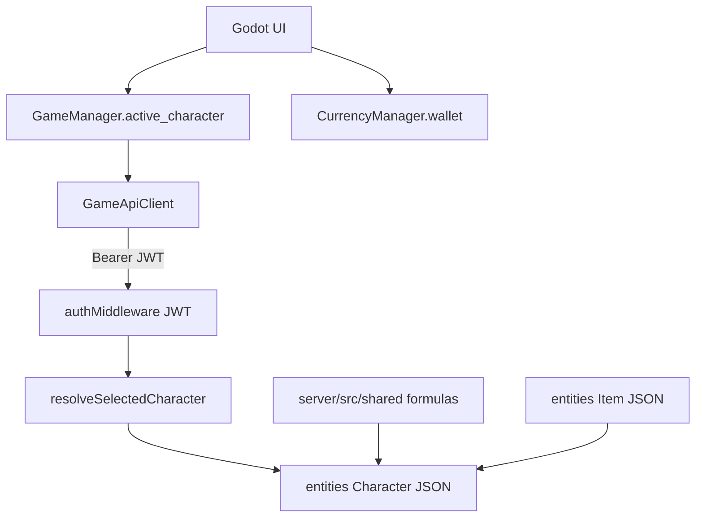

# Layer 2 — Shared Gameplay Foundation

Architecture: Nakama owns authentication/accounts/sessions. **Node owns all gameplay.**
Godot mirrors authoritative state for presentation and must never invent balances,
progression, or inventory.

This document is the Layer 2 contract and completion report.

## Architecture

## 1. Existing gameplay foundation

| Concern | Authoritative location |
|---------|------------------------|
| Account + selected Character pointer | `users` row (`active_character_id`) |
| Character progression / economy fields | `entities` type `Character` (JSON) |
| Inventory / gear instances | `entities` type `Item` |
| Selected Character resolution | [`server/src/gameplayContext.js`](../server/src/gameplayContext.js) |
| Economy field forge prevention | [`CHARACTER_ECONOMY_FIELDS`](../server/src/entityAccess.js) |
| Economy / XP / loot formulas | [`server/src/shared/*`](../server/src/shared) (re-exports `src/lib` where identical) |
| Attribute + derived sheet | Node: [`server/src/shared/characterAttributes.js`](../server/src/shared/characterAttributes.js) + `statEngine` / EPA re-exports (`docs/PHASE_ATTRIBUTES.md`) |
| Combat settlement / passives | Mission + dungeon: Node `Prepare*` + committed combat (`docs/PHASE_COMBAT.md`). Class passives: `docs/PHASE_CLASS_PASSIVES.md`. Arena/guild Node combat settlement still deferred. |
| Godot Character cache | [`GameManager`](../loot&lasers/Autoload/GameManager.gd) |
| Godot wallet projection | [`CurrencyManager`](../loot&lasers/Autoload/CurrencyManager.gd) |

Named `*Service` classes are not required. Live equivalents:

| Desired name | Actual module |
|--------------|---------------|
| CharacterService | entities.Character + entityAccess + gameplayContext |
| ProgressionService | BuyAttribute + applyCharacterRewards / applyXpToCharacter |
| EconomyService | functions/economy.js + economyFollowOn.js + shared formulas |
| RewardService | rewards/service.js + shared/rewards.js |
| InventoryService | Item CRUD + inventoryGrant.js |
| FormulaService | shared/{stardustEconomy,itemGeneration,rewards,economyFormulas} |
| ValidationService | gameplayContext + entityAccess + entitlement guards |

## 2. Character model (de facto contract)

Schemaless JSON document. Create path forces ([`sanitizeCreatePayload`](../server/src/entityAccess.js)):

- Identity: `name`, `class`, `race` (optional), `created_by_id`
- Progression: `level`, `experience`, `experience_to_next_level`, `unspent_stat_points`
- Stats: `stats` (class bases), `attribute_purchases`, `attribute_purchases_by_stat`
- Currencies: `stardust`, `total_stardust_earned`, `nova_crystals`, `fuel`, `max_fuel`, fuel purchase clocks
- Mission pointers: `active_mission_id`, `mission_end_time`, `missions_completed`, `highest_sector`
- Equipment map: `equipped_items`
- Locked economy/progression keys listed in `CHARACTER_ECONOMY_FIELDS` (client cannot PATCH)

Also commonly present from handlers: mining/dungeon/arena counters, `active_buffs`,
ships/mods, shop meta, discoveries, titles/achievements, cosmetics.

Item documents: gear/consumable payloads with `character_id` / ownership stamps;
non-admins may only PATCH `is_equipped` / `locked`.

## 3. Shared services / helpers

- [`resolveSelectedCharacter`](../server/src/gameplayContext.js) — sole selected-Character resolver for functions
- [`requireMyChar`](../server/src/functions/economyFollowOn.js) — thin wrapper
- [`characterSheet.js`](../server/src/shared/characterSheet.js) — create-shape assert + persisted sheet input reader (no combat engine)
- [`apply_authoritative_response`](../loot&lasers/Autoload/ApiClient.gd) — Godot apply path into GameManager/CurrencyManager
- [`GameManager.selected_character_id`](../loot&lasers/Autoload/GameManager.gd) — live selection id (Character cache, then Node `user.active_character_id`)

## 4. Shared formulas (authority map)

| Domain | Authoritative file |
|--------|-------------------|
| Stardust / vendor / attr cost / drop chances | `src/lib/stardustEconomy.js` (Node re-exports) |
| Gear stat budgets / rolls | `src/lib/itemGeneration.js` (Node re-exports) |
| XP curve, scaleXpReward, reward applicator | `server/src/shared/rewards.js` (must stay synced with gameData XP helpers) |
| Shop / ships / stims / fuel mounts / class bases | `server/src/shared/economyFormulas.js` (port of gameData + fuelMounts) |
| Collection XP % | `server/src/shared/collectionBonus.js` (catalog counts from `src/lib`) |
| Mission duration | `src/lib/missionDuration.js` (direct Node import) |
| Combat / passives / expected attrs | Node re-exports `statEngine` + `expectedPlayerAttributes`; sheet via `characterAttributes` — combat settle / passives still deferred |

## 5. Shared persistence

Persists through logout, reconnect, server restart, and session refresh:

- Character JSON in SQLite `entities`
- Item JSON in `entities`
- `users.active_character_id`
- Reward claims / wallet operation receipts / pending loot tables

Godot caches are display-only and cleared on logout.

## 6–8. Files / functions changed / duplicates removed

### Files modified / added

- `docs/LAYER2_SHARED_FOUNDATION.md` (this report)
- `docs/ROADMAP.md` — Layer 2 row
- `server/src/functions/index.js` — `myCharacter` → `resolveSelectedCharacter`
- `server/src/shared/stardustEconomy.js` — re-export `src/lib`
- `server/src/shared/itemGeneration.js` — re-export `src/lib`
- `server/src/shared/collectionBonus.js` — catalog-derived denominators
- `server/src/shared/characterSheet.js` — create-shape + sheet inputs
- `server/src/entityAccess.js` — `assertCharacterCreateShape` on player create
- `src/lib/gameData.js` — `scaleXpReward` matches server
- `server/scripts/test-shared-foundation.mjs` + `npm run test:shared-foundation`
- Godot: `GameManager.selected_character_id`; apply convergence in Mission, Inventory, Stats, CrystalStore, Mining, Ship, Casino, Progress, Account; ProfileManager selection fallbacks removed from Inventory/Equipment/Mission payload helpers

### Duplicates removed

- Parallel full copies of `stardustEconomy.js` / `itemGeneration.js` under `server/src/shared` (now re-exports)
- Parallel soft Character resolvers in `functions/index.js`

## 9. Remaining technical debt (later prompts)

| Debt | Owner prompt |
|------|----------------|
| Client-trusted `body.won` (arena/dungeon/mission soft combat) | Combat / Arena / Missions |
| Nakama shadow inventory/equipment | Pipeline 3 |
| ShopManager Nakama live path | Pipeline 4 |
| ArenaManager Nakama live path | Pipeline 5 |
| Dead MissionManager Nakama helpers | Pipeline 6 |
| Full combat settlement on Node | Combat / Arena / Missions restoration |
| Class passive application in sheet | Intentionally combat-time only (unchanged) |
| Dual `economyFormulas` ↔ `gameData` port drift | Keep parity tests; dedicated formula sync if needed |
| Dead `MISSION_CONSUMABLE_DROP_CHANCE` / stale attr waypoints in gameData | Cleanup when touching stims/attrs |
| rewards.js `gearTotal = allItems.length` vs catalog size | Rewards / collection prompt |

## 10. Regression risks

- Collection % denominator now follows live catalog lengths (was hardcoded 30/100/500/10 — should match today).
- `scaleXpReward` on web now scales like server (preview UI may show higher XP at higher levels).
- Function handlers that expected soft-null character still get 404/409 codes via shared resolver when `required` is true.

## 11. Test results

- `npm run test:shared-foundation` — PASS
- `npm run test:entity-access` — PASS
- `npm run test:godot-api-client` — PASS
- Godot `_audit_all.gd` — AUDIT_OK (141 scripts, 39 scenes)

## 12. Preserve

Auth, JWT, installer, BackendEnvironment, request pipeline, and working domain
logic were not redesigned.
