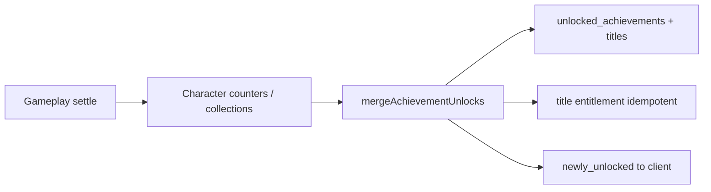
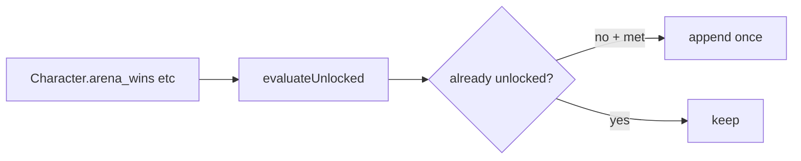
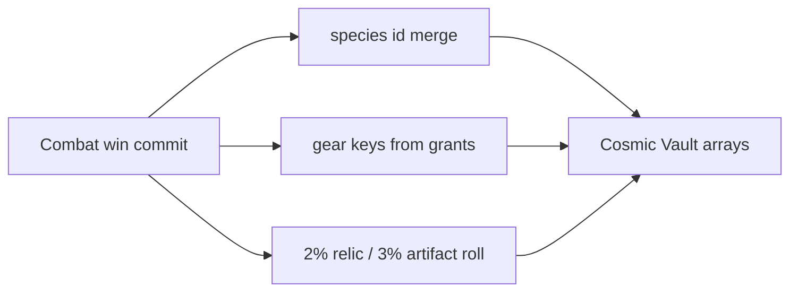
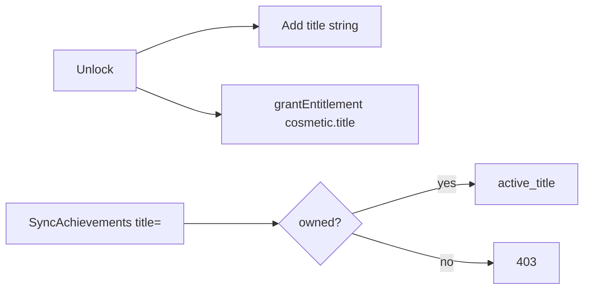
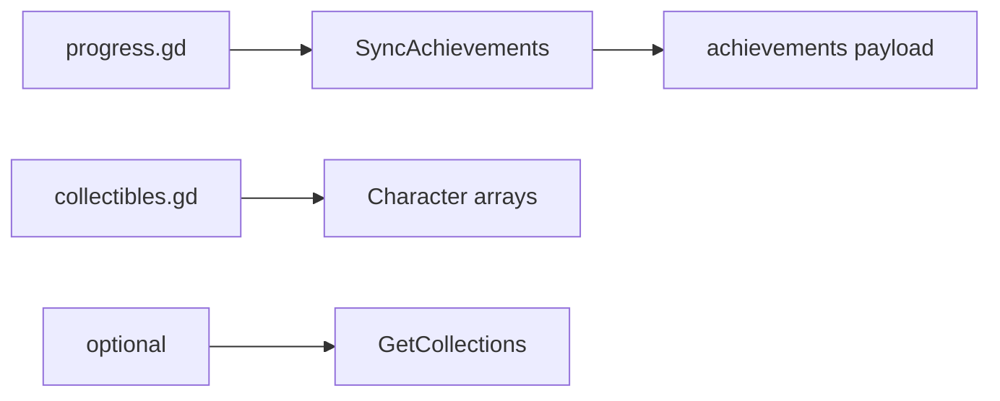

# Phase / Restoration 20 — Achievements, Milestones, and Collections

Architecture: **Nakama = auth only.** Node owns achievement definitions,
evaluation, completion, title entitlements, and collection discovery. Godot/web
are presentation + `SyncAchievements` / `GetAchievements` / `GetCollections`.

## Completion verdict

Restored the existing **24 title-only** achievements as a structured Node
registry, hardened client mutation rejection, added read serializers, and moved
artifact/relic combat discovery onto Node (same 2%/3% rates as the legacy web
preview). No new achievements, currency rewards, tiers, or hidden secrets were
invented.

---

## Completion report (prompt checklist)

### 1–6. Architecture & definitions

| Item | Finding |
|------|---------|
| Authority | `server/src/shared/achievements.js` |
| Mirrors | `src/lib/achievements.js`, `AchievementsCatalog.gd` (display) |
| Count | **24** stable IDs (all enabled) |
| Incomplete/speculative | None disabled — all had authoritative Character sources |
| Obsolete | None |
| Categories | Combat, Progression, Exploration, Economy |

### 7–14. Scope, types, tiers, milestones, hidden, prereqs, composite

- **Scope:** all **character**-scoped.
- **Progress:** threshold (`gte`) on Character counters / array lengths.
- **Tiers:** not present as a separate system (related thresholds are separate IDs).
- **Milestones:** Scout bay (`ClaimScoutMilestone`, level 20 ship mod) is **not**
  an achievement — left as ship claim.
- **Hidden / prerequisites / composite:** **absent** — not invented.

### 15–16. Collections

| Collection | Field | Semantic |
|------------|-------|----------|
| Species | `discovered_species` | Historical discovery |
| Artifacts | `collected_artifacts` | Historical discovery |
| Relics | `collected_relics` | Historical discovery |
| Gear | `discovered_gear` (`type:base_name`) | Historical discovery |
| Dungeon badges | derived from `dungeon_planet` | Progress-derived |

Ongoing reward: **collection XP %** via `collectionBonus.js` — no per-completion chests.

### 17–22. Persistence & rewards

- Completion: `unlocked_achievements[]` + `unlocked_titles[]` on Character.
- Rewards: **title only** + entitlement `cosmetic.title.{achId}`.
- Claim mode: **automatic** on unlock; title **equip** manual via
  `SyncAchievements({ title })`.
- No `ClaimAchievementReward` — not required (no currency/item rewards).
- Unsupported reward defs: none on catalog.

### 23–32. Integration status

| Domain | Status |
|--------|--------|
| Statistics (19) | Achievements read same Character fields |
| Mission | merge + artifact/relic roll on claim win |
| Combat | peak damage not an achievement source |
| Dungeon | merge + roll on finish win |
| Arena | merge + roll on finish win |
| Mining / Stim / Casino | no achievement defs |
| Economy | `total_stardust_earned` thresholds |
| Inventory/Gear | `mergeDiscoveredGear` on grants |

### 33–37. Retroactive / rebuild / reconcile

- **Retroactive:** `SyncAchievements` / `mergeAchievementUnlocks` re-evaluates
  from current Character state; unlocks permanent; title entitlements idempotent.
- **Reward policy:** titles only — grant entitlement if missing.
- **Gaps:** pre-R20 combat artifact/relic finds that only appeared in client
  toasts were never persisted — not fabricated.
- Rebuild: Sync is the rebuild; no wipe-and-recreate.

### 38–39. Notifications / Godot

- Boundary: `newly_unlocked` on settle/sync payloads; Godot
  `ProgressManager.toast_newly_unlocked`. Delivery platform → Prompt 22.
- Godot: `ProgressManager.sync_achievements` / `load_achievements` /
  `load_collections`; UI `progress.gd` + `collectibles.gd`.

### 40–46. Files

**Node:** `achievements.js`, `discovery.js`, `rewards.js` (dedupe),
`economy.js`, `economyFollowOn.js`, `functions/index.js` (`GetAchievements`,
`GetCollections`, hardened `SyncAchievements`), `test-achievements.mjs`.

**Godot:** `ProgressManager.gd`.

**Web:** `discovery.js` comment (presentation-only).

**DB migrations:** none.

**Removed:** local `mergeSpeciesDiscovery` duplicate in `economyFollowOn.js`.

**Retained:** title-only auto-unlock; Scout milestone as ship claim; client
catalog mirrors for UI.

### 47–51. Strategies

- Evaluate after Character patch projection in same settle transaction.
- Unlock arrays unioned — permanent; duplicate events → empty `newly_unlocked`.
- Title entitlements: `achievement-title:{characterId}:{achId}`.
- Performance: evaluate 24 defs only (cheap); no login full-history rebuild.

### 52. Security

- Client progress/completion/collection injection rejected.
- Title equip requires unlocked title.
- Collection/economy fields remain entityAccess-locked.

### 53–57. Tests

`npm run test:achievements` — **16 passed**.

Regression: `test:statistics` + `test:arena-authority` (run with this phase).

### 58–61. Unsupported / deferred

- No hidden achievements, tiers-as-family, account-scoped achievements,
  currency achievement rewards, mining/casino/stim achievements.
- Daily/weekly tasks → Prompt 21.
- Notification delivery → Prompt 22.
- Public profile showcase → Prompt 23.
- Admin rebuild UI → Prompt 26.

### Regression risks

- Artifact/relic now persist on Node wins — Cosmic Vault counts may rise vs
  prior toast-only behavior (intended restoration).
- SyncAchievements backfills title entitlements for all unlocked IDs (idempotent).

---

## Diagrams

### Evaluation

### Statistics → achievement

### Collection discovery

### Reward / claim

### Godot load

