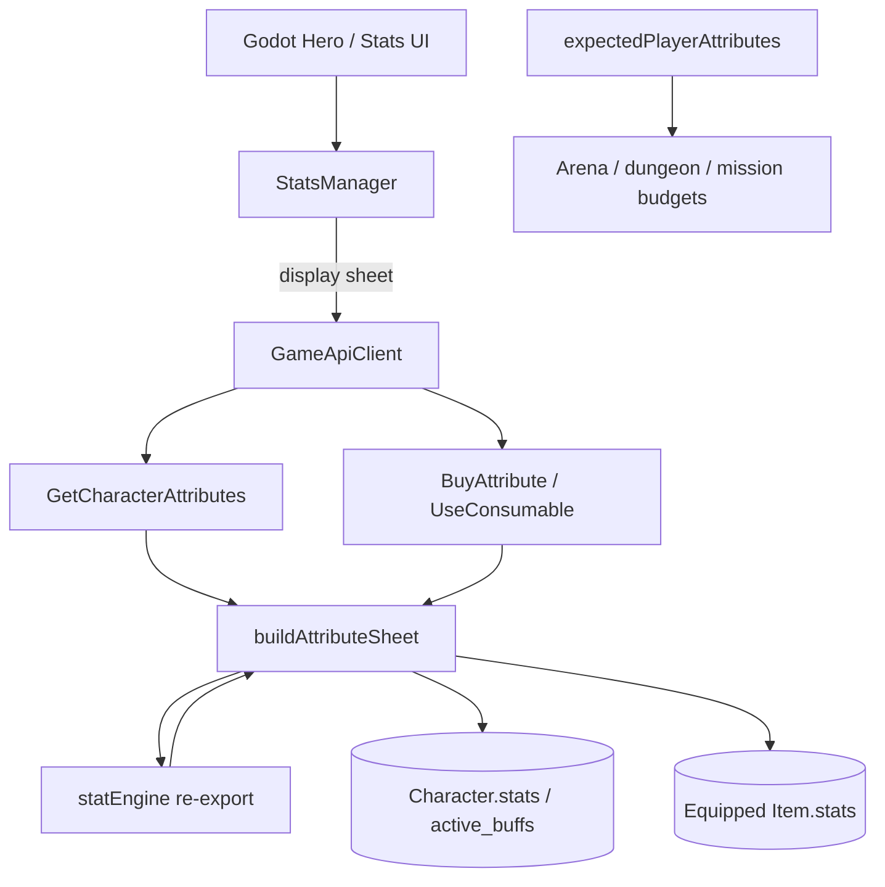

# Restoration 05 — Core Attribute System & Derived Statistics

Architecture: Nakama owns auth/accounts/sessions. **Node owns attribute
authority.** Godot displays authoritative sheets and may preview locally.

Combat settlement, class-passive combat behavior, gear generation, stim
mechanics, and reward formulas were **not** redesigned in this phase.

## 1. Existing attribute implementation

| Concern | Location |
|---------|----------|
| Permanent attrs (`strength`…`luck`) | `Character.stats` in Node entities |
| Stardust purchases | `BuyAttribute` → mutates `stats` + purchase counters |
| Level-gained attrs | `characterProgression.grantCharacterXp` (2/level) |
| Client PATCH of `stats` | Blocked by `CHARACTER_ECONOMY_FIELDS` |
| Equipment flat bonuses | `Item.stats` on equipped rows (`is_equipped`) |
| Stim multipliers | `Character.active_buffs` via `UseConsumable` |
| Prior sheet math SoT | `src/lib/statEngine.js` (web + Godot mirrors) |

## 2. Existing derived-stat implementation

Authoritative formulas already lived in `src/lib/statEngine.js`:

- Max HP ← vitality (`getMaxHP`)
- Sheet damage ← primary attr curve (`getBaseDamageFromPrimary`, AGI ×0.925)
- Crit chance / dodge ← soft-cap % (`luck` / `agility`)
- Might Resistance (Armor) / Tech Resistance ← soft-cap % (class-gated)
- Crit damage multiplier ← `CRIT_MULT` (1.5)
- Combat power ← weighted permanent totals

Godot `StatsRules` / `MissionCombat` and web UI already mirrored these for
presentation/preview. Initiative is not implemented in the live formula set.

## 3. Shared calculations restored

| Module | Role |
|--------|------|
| `server/src/shared/statEngine.js` | Re-export of `src/lib/statEngine.js` |
| `server/src/shared/expectedPlayerAttributes.js` | Re-export of EPA + mission/dungeon/arena budgets |
| `server/src/shared/characterAttributes.js` | `buildAttributeSheet` — permanent / gear / stim / effective / derived |
| `GetCharacterAttributes` | Read-only Node function for selected Character |
| `BuyAttribute` / `UseConsumable` | Additive `sheet` on success |

Effective attributes = permanent totals (base + gear + race) × active Stim
multipliers. **Class passives remain combat-time** (existing design — not folded
into the sheet).

Enemy scaling continues to consume EPA helpers (`expectedPlayerAttributes`,
`dungeonEnemyAttributeBudget`, `missionEnemyAttributeBudget`, arena bot
generator). Node arena bots already call `generateArenaBot` which uses EPA.

## 4. Duplicate calculations removed / avoided

- No second Node copy of soft-cap / HP / damage curves — re-export only.
- Sheet builder is the single Node assembly point; consumers call it instead of
  ad-hoc summing.
- Godot Hero page prefers `StatsManager.authoritative_sheet`; `StatsRules`
  remains a local preview fallback (not gameplay authority).

## 5–6. Files / functions modified

### Added

- `server/src/shared/statEngine.js`
- `server/src/shared/expectedPlayerAttributes.js`
- `server/src/shared/characterAttributes.js`
- `server/scripts/test-character-attributes.mjs`
- `docs/PHASE_ATTRIBUTES.md` (this report)

### Modified

- `server/src/functions/economy.js` — `GetCharacterAttributes`; sheet on buy/stim
- `server/src/shared/characterSheet.js` — re-exports attribute helpers
- `server/package.json` — `--import` src-alias for `@/` (statEngine → gameData)
- `package.json` — `test:attributes`
- `src/lib/statEngine.js` / `expectedPlayerAttributes.js` — stale level-attr comments
- `loot&lasers/Autoload/StatsManager.gd` — fetch/cache sheet; prefer Node fields
- `loot&lasers/Scenes/UI/stats.gd` — display via StatsManager sheet helpers
- `docs/ROADMAP.md`, `docs/LAYER2_SHARED_FOUNDATION.md`

### Key functions

- `buildAttributeSheet`, `loadEquippedItemsForCharacter`, `readPermanentAttributes`
- `GetCharacterAttributes`
- `StatsManager.load_attribute_sheet` / `display_totals` / `permanent_totals` /
  `naked_totals` / `derived_stats` / `next_cost`

## 7. Remaining issues

- Combat settlement still accepts client-trusted outcomes in some paths (prior debt).
- Class passives not in sheet totals (intentional; combat prompt).
- Web Character page still computes locally from the same `statEngine` (parity OK;
  optional later switch to `GetCharacterAttributes`).
- Current HP is not a separate persisted field in live schema — only derived max HP.

## 8. Regression risks

- Server start now requires `@/` alias registration (updated `server` scripts).
- Godot Hero values depend on `GetCharacterAttributes` after refresh; if the call
  fails, UI falls back to local `StatsRules` preview.
- Additive `sheet` on BuyAttribute/UseConsumable is ignored by older clients.

## 9. Test results

- `npm run test:attributes` — run after this phase
- Existing: `test:expected-player`, `test:stims`, `test:dungeon-enemy`, `test:arena-bot`
  continue to exercise EPA / derived formulas via `src/lib`

## 10. Architecture

## Preserve

Mission balance, gear generation, stim rules, passives, combat settle, and
economy formulas were not retuned — only wired through the shared attribute layer.
