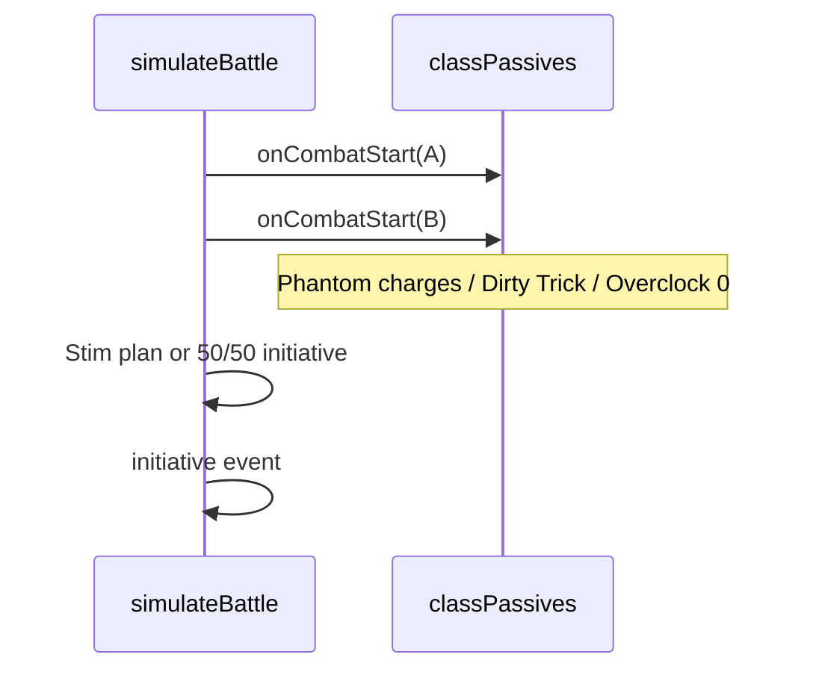
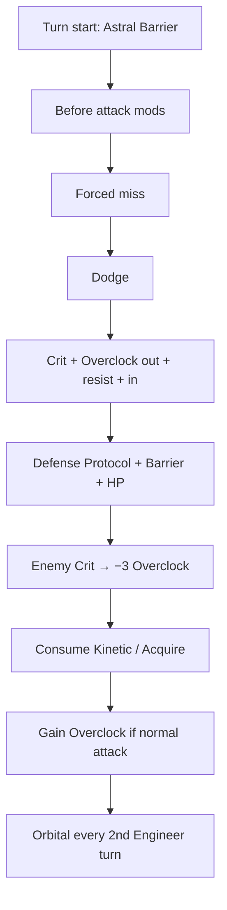
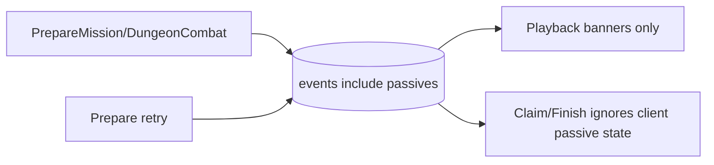

# Phase / Restoration 09 — Class Passive Engine

Architecture: Nakama owns auth only. **Node owns all passive mechanics** through the
shared combat engine (`src/lib/classPassives.js` + `arenaEngine.js`). Godot plays
committed events; it must not roll or apply passive outcomes for settlement.

## Completion report

### 1. Existing authoritative passive architecture found

`src/lib/classPassives.js` — registry, state, hooks (`onCombatStart`, `onTurnStart`,
Kinetic/Phantom/Overclock/Orbital helpers, `applyDamageWithBarrier`).
Invoked exclusively by `src/lib/arenaEngine.js` during `simulateBattle`.
Node façade: `server/src/shared/classPassives.js` (+ combat via Prompt 08).

### 2. Class-to-passive mapping

| Class | Passive |
|-------|---------|
| Vanguard | Kinetic Tantrum |
| Astral Warden | Astral Barrier |
| Shadow Operative | Phantom Signal |
| Void Runner | Dirty Tricks |
| Technomancer | Overclock |
| Cosmic Engineer | Orbital Assistant |

### 3. Superseded implementations found

No active Temper Flare / Now You See Me / Bag of Tricks strings in `PASSIVE_BY_CLASS`
or class specials. Legacy Arena bot class renames remain in `ladderBotToOpponent` only
(Shadowblade→Shadow Operative, etc.) — not passive names.

### 4. Passive combat hooks found

Combat start → initiative/stim plan → turn start → before-attack mods → forced miss →
Dodge → Crit → outgoing Overclock → resistance → incoming Overclock → Defense Protocol →
barrier → HP → Crit stack loss → consume next-attack mods → Overclock gain → Orbital.

### 5. Passive event priority found

Matches Prompt 08 engine order. Documented conflict: Prompt 09 prose lists Crit before
Overclock outgoing; **existing engine applies Overclock outgoing before Crit** (Prompt 08
hook). Preserved — not redesigned.

### 6. Temporary passive-state architecture

`createPassiveState()` on each fighter: `kineticTantrum`, `phantomCharges`, `dirtyTrick`,
`overclockStacks`, `engineerTurns`, `nextIncomingDamageMult`, `nextAttackCritBonus`,
plus fighter `barrier`. Encounter-only; cleared by building fresh fighters.

### 7. Vanguard — Kinetic Tantrum

Two branches: enemy Dodge → `strong` (guaranteed hit + 2.0× Crit); self Dodge → `normal`
(guaranteed Crit, still Dodgeable). Strong never downgraded by Normal. Forced miss does
not trigger. Consumed on next normal-attack attempt.

### 8. Astral Warden — Astral Barrier

10% once per Warden turn start; `ROUND(15% Max HP)`; refresh replaces (no stack).
Absorbs all damage types including True. Emits `barrier_absorbed` / `barrier_broken`.

### 9. Shadow Operative — Phantom Signal

Exactly **2** combat-start charges; forced `miss` (not Dodge); no Kinetic trigger.

### 10. Void Runner — Dirty Tricks

Equal 1/3 Flashbang / Targeting Beacon / Stim Injector. Cap-breaking +7.5pp Dodge/Crit.
Stim Injector: runner, runner, other, then alternate.

### 11. Technomancer — Overclock

Start 0; **+1 after every normal attack attempt including miss/dodge** (fixed this phase);
+12.5% dealt / +5% taken per stack; enemy Crit removes 3 (floor 0). **No stack cap** in
authoritative code — reported intentionally.

### 12. Cosmic Engineer — Orbital Assistant

Every 2nd Engineer turn, **before** the Engineer's attack; 1/3 Fire Support / Defensive Protocol / Acquire Target.
Fire Support: secondary True Damage, **can Dodge** (fixed this phase), cannot Crit,
not a normal attack — resolves first so the Engineer still attacks if the foe lives.
Acquire Target: +40 Crit on **that same** Engineer attack. Defensive Protocol: −25% until the Engineer is hit.

### 13. Dirty Tricks probability validation

Statistical n=3000: each trick ~30–37% (equal implementation `floor(rng*3)`).

### 14. Orbital Assistant probability status

Equal 1/3 via `ORBITAL_EFFECTS[floor(rng*3)]`. Statistical n=3000 confirmed. No alternate
weighting found.

### 15. Cross-passive interaction handling

Phantom miss ≠ Dodge; Crit through barrier still removes Overclock; Fire Support does not
advance Engineer turn twice; Stim Injector still runs turn-start hooks per attack.

### 16. Node files changed

- `src/lib/classPassives.js` — Fire Support dodge; barrier_broken; refresh comments; banners
- `src/lib/arenaEngine.js` — Overclock/Orbital after miss/dodge; skip Orbital on death
- `server/src/shared/classPassives.js` (new re-export)
- `server/scripts/test-class-passives.mjs` — expansions + statistics

### 17. Godot/GDScript files changed

- `loot&lasers/Scripts/ClassPassives.gd` — presentation-only docs; Fire Support dodge parity
- `loot&lasers/Scripts/MissionCombat.gd` — settlement authority clarification

Playback already uses `ClassPassives.resolve_ability_banner` on committed events.

### 18. Database / persistence

None. Passive state is not stored on Character.

### 19. Authoritative functions modified

`resolveNormalAttack`, `maybeOrbitalAssistant`, `applyDamageWithBarrier`.

### 20. Duplicate passive/combat logic removed

None deleted. Godot mirrors retained for banners / non-settlement previews only.
Mission/dungeon settlement already Node-authoritative (Prompt 08).

### 21. Legacy behavior intentionally retained

- Overclock before Crit in `resolveBasicHit` (Prompt 08 order)
- UI label “Defensive Protocol” (gameData) vs prompt shorthand “Defense Protocol”
- Internal `armorPercent` key (display = Might Resistance)
- Guild-war / Arena client sims still local (deferred settlement — see conflicts)

### 22. Idempotency and replay

Committed Prepare* event sequences include all passive rolls; retries return stored
combat; Godot replays events without re-executing passives.

### 23. Tests added or updated

`npm run test:passives` — registry, Overclock-on-dodge, Fire Support dodge, barrier_broken,
shared SimulateCombat modes, statistical Dirty/Barrier/Orbital.

### 24. Deterministic test results

**27 passed, 0 failed** (`test:passives`)

### 25. Statistical validation results

| Check | Result |
|-------|--------|
| Dirty Tricks 1/3 | PASS (~33% each) |
| Astral Barrier 10% | PASS (~8–12% band) |
| Orbital actions 1/3 | PASS (~33% each) |

### 26. Prompt 08 regression

`npm run test:combat` — **23 passed**.

### 27. Remaining conflicts / unresolved rules

1. Crit vs Overclock order: Prompt 09 prose vs Prompt 08 engine — kept Prompt 08.
2. Defense Protocol / Acquire Target re-proc: refresh single pending (no stack) — ambiguity
   resolved conservatively; reported here.
3. Overclock: **no max stack cap** in code — none invented.
4. Arena web + `FinishArenaBattle` still client-trusted for win (not passive engine).
5. Godot Arena Nakama path / GuildWar local sim — presentation/local only.

### 28. Defects deferred

Arena/guild Node combat settlement with passives; full Arena bot passive presentation
polish beyond event banners.

### 29. Regression risks

- Fire Support now Dodgeable → slightly lower Engineer DPS vs high-Dodge foes
- Overclock stacks on miss/dodge → faster stack growth than pre-fix builds
- Godot installer needed for ClassPassives/MissionCombat comment + Fire Support mirror

### 30. Passive initialization sequence



### 31. Passive event-timing diagram



### 32. Per-class state machines (summary)

- **Vanguard:** null ↔ normal ↔ strong (strong dominates)
- **Warden:** barrier 0 ↔ amount ↔ refresh-to-full
- **Shadow:** charges 2→1→0
- **Void:** one trick locked for combat
- **Techno:** stacks 0..∞; −3 on Crit
- **Engineer:** turn%2; pending Defense/Acquire one-shot

### 33. Combat commit and passive replay



## Commands

```bash
npm run test:passives
npm run test:combat
```
