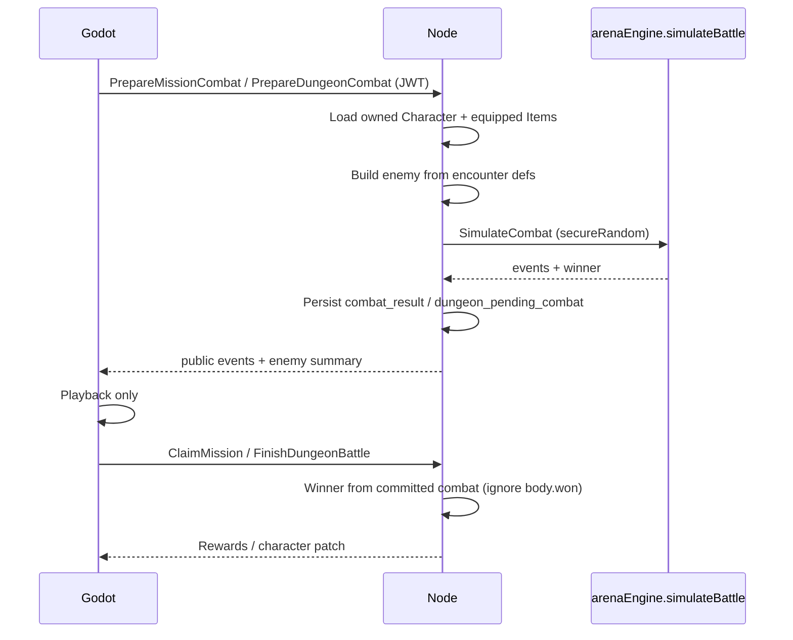
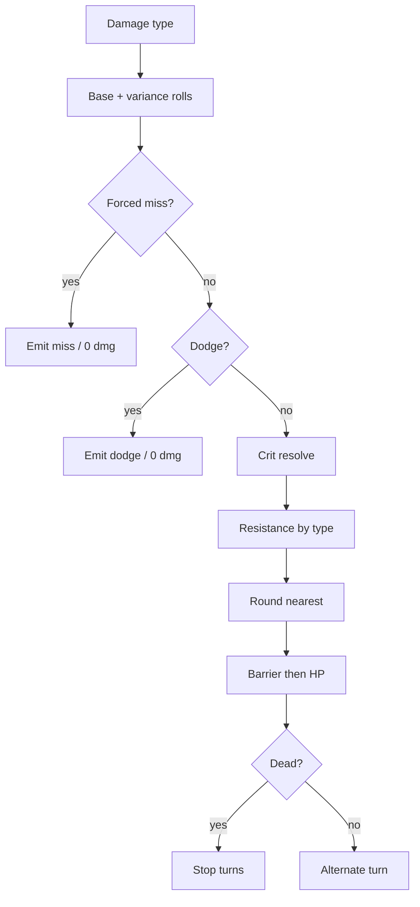
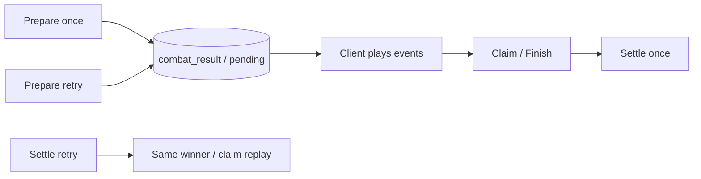

# Phase / Restoration 08 — Authoritative Combat Engine

> **Phase 3 (production combat):** Live settlement is `src/lib/arenaEngine.js` + `src/lib/combatMath.js` + locked `productionMath`. Class passives are `src/lib/classPassives.js`. See **`docs/PHASE3_COMBAT.md`**. Historical notes below (Reflex AGI variance, Armor/Tech, Nakama Arena) are pre-Phase-3.

Architecture: Nakama owns auth/sessions. **Node owns all combat authority.**
Godot request combat, play committed events, and never decide outcomes.

## Completion report

### 1. Existing authoritative combat engine found

`src/lib/arenaEngine.js` → `simulateBattle` (with `resolveNormalAttack` / `resolveBasicHit` /
`applyHealing`, hooks into `src/lib/classPassives.js`, formulas from `src/lib/statEngine.js`).

### 2. Additional or duplicate combat engines found

| Location | Role after restoration |
|----------|------------------------|
| `server/src/shared/combatEngine.js` | Re-export façade for Node |
| `server/src/shared/combatService.js` | Orchestration: snapshots, prepare/commit, SimulateCombat |
| `loot&lasers/Scripts/MissionCombat.gd` | Legacy GDScript mirror — **no longer used for mission/dungeon outcomes** (still used by StatsRules / GuildWar local preview) |
| Web `simulateBattle` imports | Arena page + guild still client-simulate (deferred); mission/dungeon now Prepare* |

### 3. Combat modes connected

| Mode | Simulator | Prepare | Settle |
|------|-----------|---------|--------|
| Mission soft encounter | Shared `simulateBattle` | `PrepareMissionCombat` | `ClaimMission` / `FailMission` (winner from `mission.combat_result`) |
| Dungeon / wormhole | Shared | `PrepareDungeonCombat` | `FinishDungeonBattle` (winner from `dungeon_pending_combat`) |
| Arena (Godot) | Shared `SimulateCombat` (`mode: "arena"`) | `PrepareArenaCombat` | `FinishArenaBattle` (winner from pending combat) |
| Arena (web) | None — no player web client | — | — |
| Guild war sim | Local / client | Deferred | `ApplyGuildWarResult` still client-trusted |
| Debug | Shared via `SimulateCombat` in tests | — | — |

### 4. Combatant snapshot architecture

`buildFighter(character, equippedItems, side)` at combat start from authoritative Character +
equipped Items (loaded server-side). Enemies from `generateMissionEncounter` /
`generateDungeonEnemy`. Client combatant payloads rejected on Prepare*.

### 5. RNG architecture

Production: `secureRandom` from `server/src/rewards/rng.js`. Tests: seeded LCG.
Committed responses do **not** expose reusable seeds.

### 6. Attack-resolution order

Forced miss (Phantom Signal) → Dodge → raw damage (+ variance) → Crit → resistance →
incoming taken mult → round → barrier → HP → death. Matches finalized pipeline.

### 7. Event model

Existing types preserved: `initiative`, `attack`, `dodge`, `miss`, `passive`, healing via
passives, barrier events. Fields include `isNormalAttack`, `damageType`, `crit`, `dodged`,
`missed`, etc.

### 8. Forced-miss vs Dodge

`type: "miss"` / `missKind: "phantom_signal"` vs `type: "dodge"`. Miss does not run Kinetic
Tantrum dodge hooks.

### 9. Normal attack vs secondary

`isNormalAttack: true` on normal attacks. Fire Support / secondary True Damage remain
passive-emitted non-normal events (Prompt 09 surface).

### 10. Reflex variance

Still two independent rolls: `Random(0.80, 1.05)` × `Random(0.90, 1.10)` in
`calculateAgilityDamage`.

### 11. Crit and resistance ordering

Crit before resistance; Crit does not bypass resistance. True Damage `canCrit: false`.

### 12. True Damage

Bypasses Might/Tech resistance; cannot Crit; default can be Dodged unless forced.

### 13. Healing primitive

`applyHealing` — no Crit/miss/Dodge; clamps to Max HP; nearest-whole via caller amounts.

### 14. Temporary combat-state architecture

Per-simulation on fighters (`hp`, `barrier`, `passiveState`). Not written to permanent
Character attrs. Cleared between encounters (new fighters each Prepare).

### 15. Node files changed

- `server/src/shared/combatEngine.js` (new)
- `server/src/shared/combatService.js` (new)
- `server/src/functions/economy.js` — `PrepareMissionCombat`; Claim ignores `body.won`
- `server/src/functions/economyFollowOn.js` — `PrepareDungeonCombat`; Finish ignores `body.won`
- `server/src/entityAccess.js` — lock `dungeon_pending_combat`
- `src/lib/arenaEngine.js` — export resolvers; initiative event; init `passiveState`
- `src/lib/classPassives.js` — null-safe Kinetic/Overclock guards
- `server/scripts/test-combat-engine.mjs` (new)
- `package.json` — `test:combat`

### 16. Godot/GDScript files changed

- `loot&lasers/Autoload/MissionManager.gd` — `PrepareMissionCombat`
- `loot&lasers/Autoload/DungeonManager.gd` — `PrepareDungeonCombat`
- `loot&lasers/Scenes/UI/arena_combat.gd` — comment (playback-only)

### 17. Database / persistence

No schema migration. Mission JSON gains `combat_result` / `combat_id`. Character JSON may
hold `dungeon_pending_combat` (server-locked field).

### 18. Authoritative functions modified / added

`SimulateCombat`, `PrepareMissionCombat`, `PrepareDungeonCombat`, `ClaimMission`,
`FinishDungeonBattle`, exported `buildFighter` / `resolveNormalAttack` / `resolveBasicHit` /
`applyHealing`.

### 19. Duplicate formulas / simulators removed from settlement path

Mission + dungeon Godot/web no longer call local `simulateBattle` for consequential fights.
`MissionCombat.gd` retained for non-settlement mirrors only.

### 20. Combat-mode integrations repaired

Mission + dungeon (+ wormhole via dungeon prepare). Arena/guild Node settlement of combat
outcome still deferred.

### 21. Idempotency strategy

- Mission: second `PrepareMissionCombat` returns stored `combat_result`
- Dungeon: same planet/enemy keys replay pending combat
- Claim/Finish: reward claims + winner from committed combat (no re-roll)

### 22. Combat transaction strategy

Prepare + Claim/Finish run inside existing `withTransactionAsync` / `wrap` paths.
Rewards still via `executeRewardClaim` for missions.

### 23. Tests added or updated

`npm run test:combat` — formulas, initiative, dodge/miss, crit/resist, True Damage, healing,
encounter independence, seeded mode parity, statistical dodge/crit.

### 24. Deterministic test results

`test:combat` — **23 passed, 0 failed**  
`test:passives` — **19 passed, 0 failed**

### 25. Statistical simulation results

Initiative ~50/50 (4000 trials, band 46–54%). Dodge ~20% and Crit ~15% within ±3pp.

### 26. Earlier regression results

`test:attributes`, `test:inventory`, `test:gear-stats`, `test:shared-foundation` — PASS.

### 27. Defects deferred to Prompt 09 / later

- Full class-passive rebalance / documentation pass
- Guild war client simulation
- Stim Injector turn override already in engine (class passive) — no change required here

### 28. Remaining conflicts / assumptions

- Internal derived key `armor` / `armorPercent` remains in code (UI copy = Might Resistance);
  no new “Armor” API field
- `MissionCombat.gd` still exists for sheet preview / guild — not settlement authority
- Dungeon patrol/farm mode removed — only the active story node is fightable (Node-validated)

### 29. Regression risks

- Clients that never call Prepare still get auto-prepare on Claim/Finish (outcome may differ
  from any local preview they already showed)
- Character documents briefly store `dungeon_pending_combat` until Finish
- Installer rebuild required for Godot; Node deploy required for Prepare* handlers

### 30. Combat simulation sequence



### 31. Attack-resolution pipeline



### 32. Commit and playback recovery



## Commands

```bash
npm run test:combat
npm run test:passives
```
