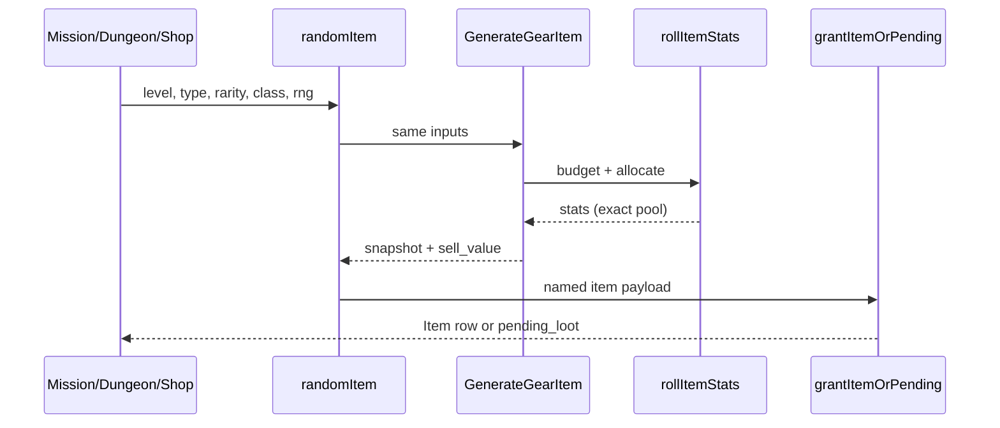
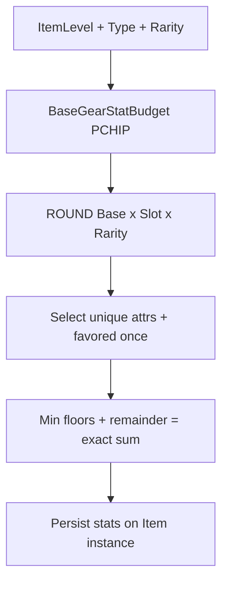

# Restoration 07 — Gear Generation & Item Persistence

Architecture: Nakama = auth only. **Node owns all gear rolls and persistence.**
Godot displays committed items only.

## Audit verdict

The finalized gear pipeline was already present in
[`src/lib/itemGeneration.js`](../src/lib/itemGeneration.js) (re-exported by
`server/src/shared/itemGeneration.js`). Mission, dungeon, shop, admin, and daily
reward paths already called `randomItem` → `rollItemStats`. No parallel
source-specific stat math was found. Godot has no gear roller.

This restoration **named and wired** the canonical entry point, confirmed
source-independence, expanded tests, and documented favored-pool reconciliation.
It did **not** retune budgets, drop chances, shop pricing, or vendor formulas.

---

## 1. Authoritative generator

| Piece | Location |
|-------|----------|
| Stats engine | `rollItemStats` / `allocateStatBudget` / `selectItemAttributes` |
| Canonical entry | **`GenerateGearItem`** (new alias wrapper) |
| Named + shop/loot payload | `randomItem` in `server/src/shared/rewards.js` (now wraps `GenerateGearItem`) |
| Node re-export | `server/src/shared/itemGeneration.js` → `src/lib` |

## 2–4. Base budget / interpolation / L>500

- Direct-value monotone cubic **PCHIP** on `BASE_GEAR_STAT_BUDGET_ANCHORS`
- Anchors: L1=12 … L500=795 (matches prompt)
- `L > 500`: `ROUND(795 + 1.63 × (L − 500))` — no hard cap

## 5–7. Slot / rarity / minima

| Rule | Implementation |
|------|----------------|
| Slot mult | Weapon & ship_module **1.20×** stat budget (`SLOT_STAT_MULT`) |
| Rarity stat mult | 0.70 / 0.85 / 1.00 / 1.20 / **1.35** (Legendary) |
| Stat counts | 1 / 2 / 3 / 3 / 5 |
| Min shares | 100% / 30% / 20% / 20% / 10% |
| Exact sum | `SUM(stats) === TotalStatPool` always |

Legendary **sale** multiplier 1.75× stays in `GearSaleValue` only — not used for stats.

## 8. Favored pools — reconciled (keep)

Already finalized in live code:

- Common–Epic with class: **once per item** 60% favored pool / 40% full pool
- Legendary: always all five attrs (`poolMode: "legendary"`)
- Verified in tests

## 9. Source-specific generators

| Source | Stat path |
|--------|-----------|
| Mission claim | `randomItem` → `GenerateGearItem` |
| Dungeon / milestones | `randomItem` |
| Shop stock | `randomItemForClass` → `randomItem` |
| Admin give_item | `randomItem` |
| Dailies / promos | `randomItem` via `applyCharacterRewards` |
| Wormhole | uses dungeon gear path (same generator) |

No separate mission/dungeon/shop budget curves.

## 10–13. Files / functions

### Changed

- `src/lib/itemGeneration.js` — `GenerateGearItem` + conceptual aliases
- `server/src/shared/rewards.js` — `randomItem` wraps `GenerateGearItem`
- `server/src/shared/inventoryGrant.js` — `PersistGeneratedItem`
- `server/scripts/test-gear-stats.mjs` — expanded Prompt 07 coverage
- `docs/PHASE_GEAR_GENERATION.md`, `docs/ROADMAP.md`

### Godot / DB

- **No Godot changes** (already presentation-only)
- **No migrations** — existing player gear preserved; not regenerated

### Key APIs

`BaseGearStatBudget`, `getItemStatBudget`, `GenerateGearItem`, `randomItem`,
`PersistGeneratedItem` / `grantItemOrPending`, `serializeItem` (Prompt 06)

## 14–16. Duplicates / migration

- No duplicate generators removed (none active)
- Existing inventories **intentionally preserved** (no mass reroll)

## 17–19. Inventory / idempotency / transactions

- Insertion: `grantItemOrPending` / `PersistGeneratedItem` / Prompt 06 inventory
- Reward claim idempotency: existing reward claim ledger (not redesigned here)
- Shop purchase / mission claim remain inside existing `withTransactionAsync` paths

## 20–22. Tests

`npm run test:gear-stats` — **14 passed** (anchors, L>500, slots, rarity, floors,
exact sum, favored once-per-item, source-independence, randomItem parity, vendor≠stat).

Also green: `test:inventory`, `test:shared-foundation`, `test:mission-gear-drop`.

Statistical sample: 40 seeds × rarities × slots for exact-sum + floors; variety check on Legendary remainder.

## 23–25. Remaining / deferred / risks

| Deferred | Owner |
|----------|--------|
| Mission drop % / pity | Later mission prompt (unchanged; tested separately) |
| Shop listing authority / pricing | Pipeline 4 / shop restoration |
| Full sell economy | Economy prompt |
| Godot loot-reveal polish | Presentation only if needed |
| Admin `give_item` pending overflow | Optional parity with grantItemOrPending |

**Risks:** `randomItem` now goes through `GenerateGearItem` validation (invalid type/rarity throw). Existing callers already pass valid slots/rarities.

## 26–27. Diagrams

