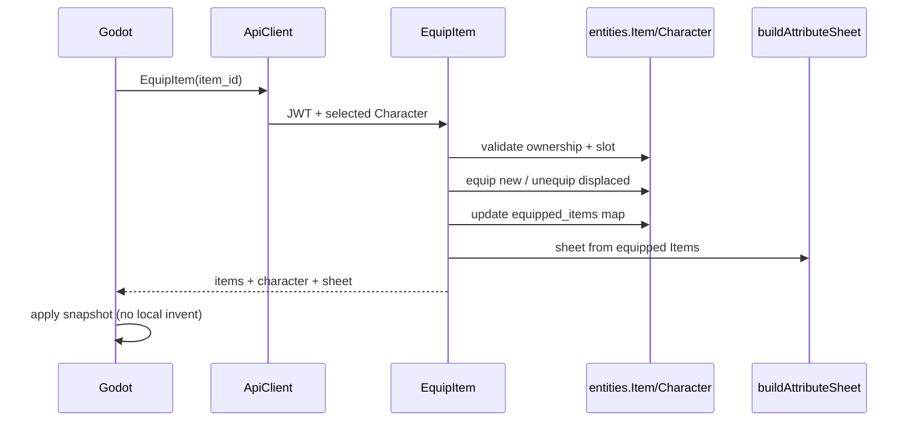
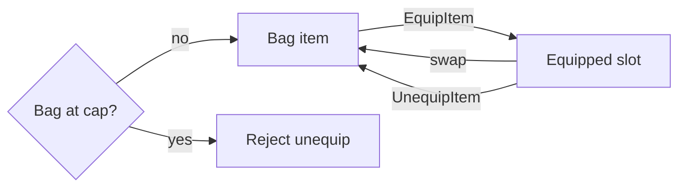

# Restoration 06 — Inventory & Equipment

Architecture: Nakama = auth only. **Node owns inventory and equipment.**
Godot displays and requests mutations; it never invents item IDs or authority.

## 1. Existing authoritative inventory

- Schemaless `entities.Item` rows in SQLite (`character_id`, `owner_id`, `is_equipped`, `locked`, `type`, `stats`, …)
- Bag occupancy = all unequipped items (`countBagOccupancy`). Cap 10. Stims/junk count.
- Grants via `grantItemOrPending` → Item create or pending loot

## 2. Existing authoritative equipment

- Equipped state = `Item.is_equipped` (source of truth for combat/attrs)
- Slot index = `Character.equipped_items` `{ [slotType]: itemId }` (now server-only)

## 3. Item / instance model

One Item document per instance (gear and consumables). No quantity stacks for gear.
Stable server-generated `id`. Stats/rarity/level snapshotted on the instance.

## 4. Equipment slots

From `EQUIPMENT_SLOTS` / Godot `InventoryRules.EQUIPPABLE_TYPES`:

`helmet`, `armor`, `legs`, `boots`, `weapon`, `neck`, `accessory`, `ship_module`

## 5. Stack rules

No inventory quantity stacking. Stim duration stacking is separate (economy formulas).

## 6. Capacity

`getInventoryCap` — hard 10 unequipped items (Gear, stims, junk). Cargo Hold / entitlements do not expand it.
Unequip blocked when full. Player actions that can grant items are blocked until a slot is free.
Overflow from an already-started dungeon finish may still go to pending loot (`grantItemOrPending` / `createPendingLoot`).

## 7. Equip replacement

Restore prior web behavior: equip new first, displace same-type equipped piece to bag (atomic in one transaction).

## 8–11. Files / services changed

### Added

- `server/src/shared/inventoryEquipment.js` — equip/unequip/snapshot/serialize
- `server/scripts/test-inventory-equipment.mjs`
- `docs/PHASE_INVENTORY.md` (this report)

### Modified

- `server/src/functions/economy.js` — `GetInventory`, `EquipItem`, `UnequipItem`
- `server/src/entityAccess.js` — lock `equipped_items`; client Item PATCH = `locked` only
- `server/src/shared/rewards.js` — item grants → bag or `pending_loot` (no stardust delete)
- Godot `AuthManager.gd` — equip/unequip → function invoke
- Godot `ApiClient.gd` / `StatsManager.gd` — apply items + sheet snapshot
- Web `src/hooks/useInventory.js` — EquipItem / UnequipItem
- `package.json` — `test:inventory`; alias on entity-access / rewards scripts
- `docs/ROADMAP.md`

### Key functions

`equipItemForCharacter`, `unequipItemForCharacter`, `buildInventorySnapshot`, `serializeItem`,
`EquipItem`, `UnequipItem`, `GetInventory`

## 12. Duplicates / obsolete paths

- Client multi-step Item+Character PATCH equip **removed** from Godot/web live paths
- Nakama `EquipmentManager` equip RPCs remain unused by UI (shadow read only — Pipeline 3 cleanup later)

## 13. Legacy retained

- Promo `fullLegendary` still creates already-equipped items
- Admin `give_item` hard-fail on full bag (not pending)
- Nakama inventory/equipment managers still load for compatibility

## 14. Reward insertion

Mission/dungeon/shop already used `grantItemOrPending`.
`applyCharacterRewards` now uses the same overflow model (`pending_loot`).

## 15. Selling / consumption

Equipped Gear cannot be sold. Gear must be unequipped before resale.
`DissolveItem` rejects equipped items (`ITEM_EQUIPPED`) with no Stardust, equipment, or Backpack mutation.
`DissolveJunk` skips equipped ids. `UseConsumable` is separate.

## 16. Effective attributes

Equip/Unequip responses include `sheet` from Restoration 05 `buildAttributeSheet`.
Permanent attrs unchanged; gear bonuses not baked into `stats`.

## 17. Transactions / concurrency

Equip/Unequip wrap `withTransactionAsync`. Idempotent re-equip / already-unequipped returns success.
Client `_busy` still serializes UI clicks.

## 18–19. Tests

`npm run test:inventory` — ownership, swap, capacity, grant/pending, persistence.
Also: `test:shared-foundation`, `test:entity-access`, `test:attributes` — PASS.
`test:rewards` requires `@/` alias (script updated).

## 20–21. Remaining / deferred

- Arena power still may read Nakama equipment shadow
- No DB unique constraint “one equipped per slot” (enforced in EquipItem logic)
- Gear gen / stim / vendor formulas — later prompts
- Admin give_item pending parity — optional later
- Full Godot E2E manual reconnect — validate in play

## 22. Regression risks

- Old clients that PATCH `is_equipped` will no-op (must use EquipItem)
- Character create must keep `equipped_items: {}` (create sanitize allowlist updated)
- Full-bag dailies now pending instead of stardust compensation

## 23–24. Diagrams

