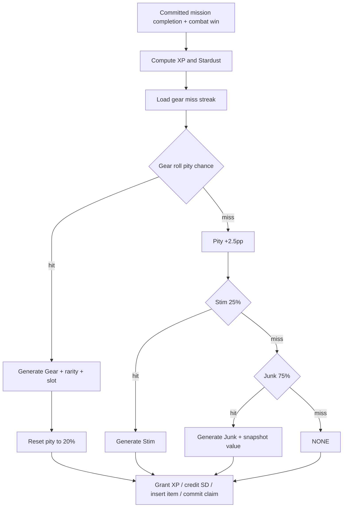
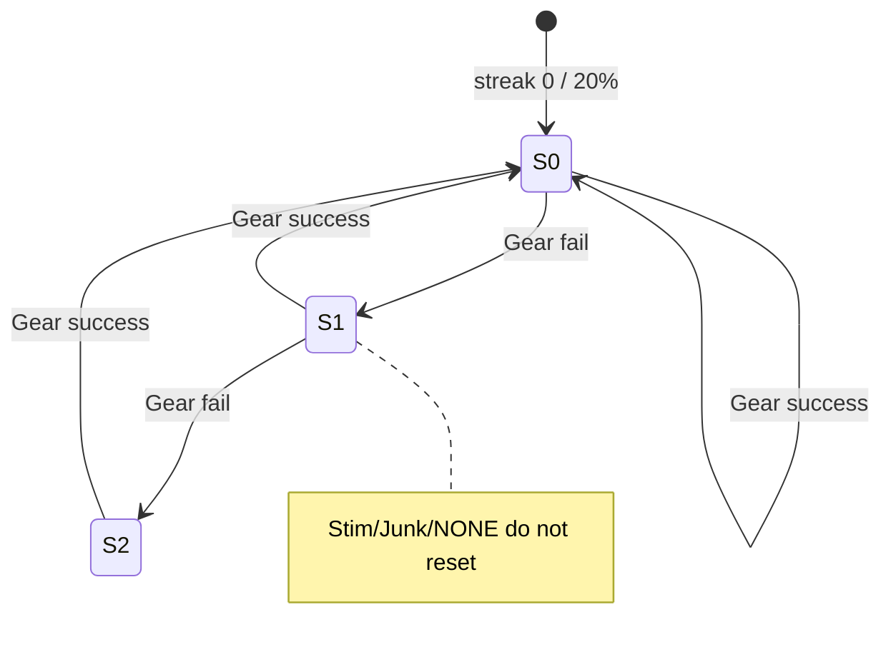
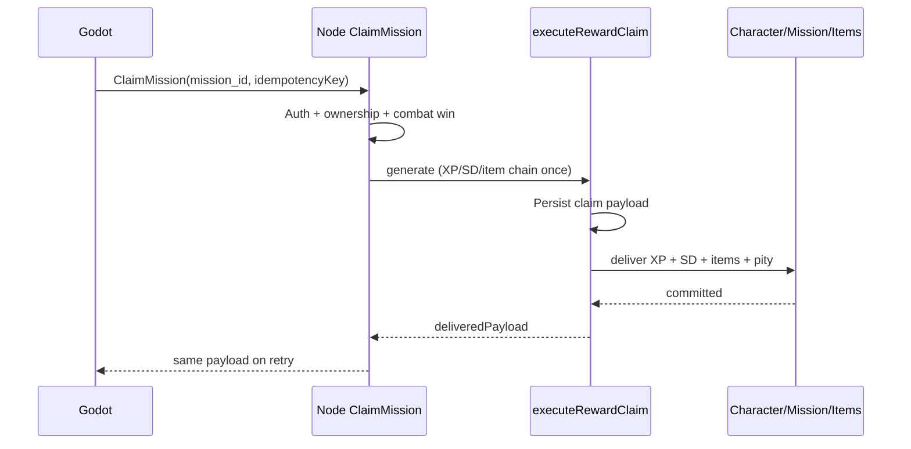
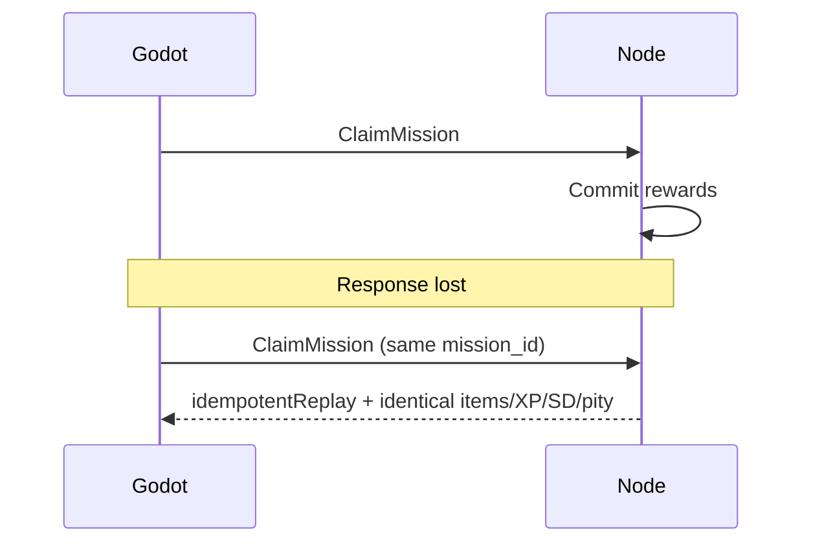

# Phase / Restoration 11 — Mission Rewards and Atomic Settlement

Architecture: Nakama owns auth/sessions. **Node owns all mission reward authority.**
Godot presents committed XP, Stardust, progression, and the exclusive item outcome.
Combat playback does not settle rewards.

## Completion report

### 1. Existing authoritative mission reward implementation found

`ClaimMission` in `server/src/functions/economy.js`, wrapping
`executeRewardClaim` (`server/src/rewards/service.js`) with claim key
`ClaimKeys.mission(missionId)`. Item chain centralized in
`server/src/shared/missionRewards.js` → `settleMissionItemChain`.

### 2. Existing reward transaction architecture

Durable `reward_claims` (generate → deliver) with idempotency key =
mission id / `ClaimKeys.mission`. Completed claims replay
`deliveredPayload` without re-rolling. Domain uniqueness blocks concurrent
double settlement. Inventory overflow uses `pending_loot` via
`grantItemOrPending`.

### 3. Existing mission XP implementation

- Primitive: `missionXpPerFuelBase` / `MissionXPPerFuel` (closed form)
- Scaled: `getMissionXpPerFuel` = primitive × `XP_STARDUST_SCALE` (10)
- Mission: `computeMissionXpFromFuel(fuel, level, xpEfficiency)`
- Grant: `applyXpToCharacter` inside claim `deliver`

### 4. Application point of `MISSION_XP_REBALANCE`

Exactly once inside `computeMissionXpFromFuel`:

`ROUND(fuel × getMissionXpPerFuel(level) × xpEfficiency × 0.85)`

### 5. Global XP-scale ordering

`XP_STARDUST_SCALE` is applied inside `getMissionXpPerFuel` **before**
mission rebalance and efficiency. Not applied again in ClaimMission.

Order: **primitive → global scale → fuel × efficiency × 0.85 → round**.

### 6. Existing Stardust formula implementation

Production authority is the closed form in `src/lib/stardustEconomy.js`:

`StardustPerFuel(L) = ROUND(50 + 1.009×(L-1)^1.625×(1+(L/166.66)^3.055))`

`MissionStardustReward = ROUND(SD/F × originalFuel)`. Mission efficiency is
intentionally ignored for Stardust. Historical PCHIP anchors retained only
as deprecated reference; AttributePurchaseCost still uses PCHIP.

### 7. Existing Gear pity representation

Integer `character.mission_gear_miss_streak`. Chance =
`0.20 + 0.025 × streak`, capped at 1.0 for RNG validity (no design soft-cap
below 100%). Roll uses streak **before** increment; success resets to 0;
Stim/Junk/NONE leave streak incremented.

### 8. Existing Gear rarity implementation

`MISSION_GEAR_RARITY_WEIGHTS`: Common 50 / Uncommon 25 / Rare 15 / Epic 8 /
Legendary 2. Pity does not alter rarity. Shop/Dungeon tables are separate.

### 9. Existing mission Gear item-level rule

**Character level at settlement** (`missionGearItemLevel`).

### 10. Existing mission Gear slot/type rule

`mission.rewards.loot_type` pinned at launch from mission name hash over
`MISSION_LOOT_SLOTS`; settlement falls back to the same deterministic mapping.

### 11. Existing Stim rarity distribution

Recovered from `randomConsumable`: **Uncommon 40% / Rare 40% / Epic 20%**.
No Common or Legendary Stims. Prompt 11 did not supply weights; this is the
authoritative existing distribution.

### 12. Existing Stim attribute-selection rule

Uniform pick from the rarity-filtered `CONSUMABLES` pool (each entry already
binds an attribute + duration). No class favoritism in the mission path.

### 13. Existing Junk generation implementation

After Gear fail + Stim fail: 75% Junk. Template type `material` with
snapshotted `sell_value = JunkSaleValue(missionStardustBase, rng)`.

### 14. Existing Junk naming/flavor system

Mission `rewards.collectible.name` when present; else `"Salvaged Trinket"` +
fixed flavor line. Name does not drive vendor value.

### 15. Existing Junk value snapshot behavior

`JunkSaleValue`: base = mission Stardust × **0.45**, × Uniform(0.60, 1.40),
round once, persist on item. Later level/formula changes do not mutate it.

### 16. Existing inventory overflow behavior

`grantItemOrPending` → bag insert or `pending_loot` row linked to claim.
Settlement does not discard committed item templates.

### 17. Node files changed

- `src/lib/stardustEconomy.js` — closed-form `StardustPerFuel`; Junk 0.45 aliases
- `server/src/shared/missionRewards.js` — **new** exclusive chain helpers
- `server/src/functions/economy.js` — ClaimMission uses chain; Launch no longer pre-rolls loot
- `server/scripts/test-mission-rewards.mjs` — **new**
- `server/scripts/test-stardust-economy.mjs` — closed-form expectations
- `package.json` — `test:mission-rewards`
- `scripts/verify-xp-stardust-scale.mjs` — SD/F expectations (prior)

### 18. Godot/GDScript files changed

- `loot&lasers/Autoload/MissionManager.gd` — Claim/Fail without client-trusted
  reward fields; post-claim uses server `won`
- `loot&lasers/Scripts/StardustEconomy.gd` — closed-form SD/F mirror; Stim/Junk constants
- `loot&lasers/Scenes/UI/arena_combat.gd` — `item_outcome` presentation notes
- Web: `src/hooks/useMissionManager.js` — ClaimMission body = mission_id + idempotency only

### 19. Database or migration files changed

None. Pity already on character; claims/pending_loot already exist.

### 20. Authoritative functions and constants modified

| Symbol | Role |
|--------|------|
| `StardustPerFuel` | Closed-form production authority |
| `settleMissionItemChain` | Exclusive GEAR→STIM→JUNK→NONE |
| `MISSION_*` drop constants | Unchanged values; Stim/Junk aliases clarified |
| `JUNK_MISSION_REWARD_MULTIPLIER` | 0.45 (alias of `JUNK_AVG_MISSION_REWARD_RATIO`) |
| LaunchMission rewards snapshot | Preview chance/streak/type only |

### 21. Duplicate or obsolete reward paths removed / isolated

- Launch-time `loot_drops` / `loot_rarity` rolls disconnected
- PCHIP Stardust no longer production for SD/F
- Superseded Junk 0.225 / 50% post-Gear path not used
- Client `won` / reward amounts ignored by ClaimMission

### 22. Legacy behavior intentionally retained

- Mission **XP efficiency** variance band on XP only
- Ship mods (`mission_xp_mult`, `mission_stardust_mult`)
- Collection XP bonus via `applyXpBonus`
- Nexus control **+5% Stardust** when applicable
- Defeat: **no XP / SD / item** when `combat.winner !== "player"`
- Direct character Stardust patch inside claim deliver (existing ledger style
  via reward claim record, not a separate wallet microservice)

### 23. XP integration status

Central `computeMissionXpFromFuel` + `applyXpToCharacter` / progression
payload. No mission-local level-up loop.

### 24. Stardust ledger integration status

Credit inside claim `deliver` with idempotent claim envelope. Amount from
`computeMissionGains` only.

### 25. Gear generator integration status

`randomItem` / shared generator on Gear success; rarity from mission table;
item level = character level.

### 26. Inventory integration status

`grantItemOrPending` for Gear/Stim/Junk templates; pending_loot on capacity.

### 27. Transaction strategy

`withTransactionAsync` + `executeRewardClaim` generate/deliver stages.
Pity update and item insert occur in the same deliver step as XP/SD.

### 28. Idempotency strategy

`ClaimKeys.mission(missionId)` + optional client `idempotencyKey`. Replay
returns identical payload (same items, pity transition already applied).

### 29. Recovery strategy

Lost response → re-Claim → completed claim replay. Partial deliver failure
does not mark completed (existing rewards tests). Combat prepare is separate
and does not grant rewards.

### 30. Tests added or updated

- `npm run test:mission-rewards` (12)
- `npm run test:stardust-economy` (13)
- Existing `test:mission-gear-drop`, `test:rewards`, verify-xp-stardust-scale

### 31. Full deterministic test results

```
test:mission-rewards     12 passed, 0 failed
test:stardust-economy    13 passed, 0 failed
test:mission-gear-drop    5 passed, 0 failed
test:rewards             10 passed, 0 failed
```

### 32. Statistical validation results

Continuous seeded sim (n=50k) of pity process ≈ Prompt targets:

| Outcome | Target | Observed band |
|---------|-------:|---------------|
| Gear | 25.83% | ~24–28% |
| Stim | 18.54% | ~16–21% |
| Junk | 41.72% | ~38–46% |
| None | 13.91% | ~11–17% |

Analytical E[cycle] gear rate ≈ **0.2583**. Mission rarity table coverage
matches 50/25/15/8/2.

### 33. Relevant regression results from Prompts 01–10

```
test:combat      23 passed
test:passives    27 passed
test:attributes  PASS
test:inventory   PASS
test:gear-stats  14 passed
test:rewards     10 passed
verify-xp-stardust-scale  All checks passed
```

### 34. Unresolved Stim-distribution details

Weights **40/40/20** recovered from code; not specified in Prompt 11 text.
If design wants different weights, confirm before changing.

### 35. Other remaining conflicts or assumptions

- Closed-form SD/F changes **shared** rates for Arena, Mining, vendor (intentional centralization).
- Mission XP still applies efficiency + ship + collection beyond bare
  `fuel × XP/F × 0.85`.
- `FailMission` is an alias into ClaimMission; combat still decides win/loss.
- Godot `claim_mission(won)` hint remains for Fail vs Claim routing only.

### 36. Defects deferred to later prompts

- Arena/web paths that still trust client win (R08 debt)
- Stim activation / stacking UX (dedicated Stim prompt)
- Shop restoration (Prompt 12)
- Full currency ledger microservice (if desired) vs character field + claim audit

### 37. Regression risks

- Players see new SD/F curve vs old PCHIP anchors (preview + economy).
- Arena/mining payouts shift with SD/F.
- Missions that previously had launch-time loot snapshots no longer carry
  pre-rolled drops (settlement-only).

### 38. Mission reward-chain diagram



### 39. Gear pity state diagram



### 40. Atomic settlement transaction diagram



### 41. Timeout and reward-recovery diagram



---

## Defeat policy (recovered)

When authoritative `combat.winner !== "player"`: mission marked `failed`;
**no** XP, Stardust, or item; Fuel already spent at launch. Matches restored
combat gate (Restoration 08).

## Manual E2E checklist

1. Nakama auth → Node JWT → load character  
2. Launch → wait/skip → PrepareMissionCombat → claim  
3. Confirm XP/SD/item_outcome from response  
4. Re-claim → identical payload  
5. Controlled RNG: Gear / Stim / Junk / NONE paths  
6. Full bag → pending_loot without reroll  

## Status

**Restoration 11 complete** for the Node settlement path + Godot presentation
bridge, subject to retained multipliers and Stim weight confirmation above.
