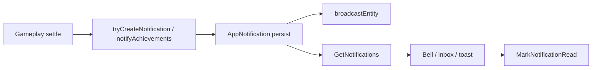

# Phase / Restoration 22 — Notifications, Event Delivery, Player Alerts

Architecture: **Nakama = auth only** (mail push code 20 remains mail-only).
**Node owns** AppNotification create / read / dismiss. Godot/web display and
request state changes.

## Completion verdict

AppNotification already persisted on Node, but clients created rows (including
every floating toast). This restoration adds `notificationService.js`, locks
entity creates, exposes Get/Mark/Dismiss/Create (whitelist) RPCs, fans out
achievement unlocks + mining collect + arena defense + DMs, and stops toast→inbox
spam.

---

## Completion report

### 1. Existing architecture

| Piece | Status |
|-------|--------|
| Entity `AppNotification` | Kept |
| Realtime broadcast | Kept (`/ws`) |
| Nakama notifications | Mail only — unchanged |
| Service | **New** `server/src/shared/notificationService.js` |

### 2. Persistence

Fields: `owner_id`, `type`, `title`, `body`, `related_id`, `priority`, `read`,
`dismissed`, `expires_at`, `idempotency_key`.

States: unread → read → dismissed; expired hidden from unread lists.

### 3. Categories

Recovered UI types + gameplay: `friend_request`, `private_message`, `mail`,
`system`, `achievement`, `arena_defense`, `mining`, `mission`, `dungeon`, …
Priorities: `critical` / `high` / `normal` / `low` (presentation).

### 4. Delivery

- Persist + entity broadcast
- HTTP GetNotifications hydrate
- Local toast / `emitLocalAlert` ephemeral only
- Godot still polls unread (RealtimeManager mail poll); WS subscribe optional

### 5. Reconnect

`GetNotifications` returns unread/inbox; badge from `counts.total`.
Idempotency keys prevent duplicate achievement/mining rows.

### 6–7. Files

**Node:** `notificationService.js`, `entityAccess.js` (create locked),
`functions/index.js` (RPCs + DM), `economy.js` / `economyFollowOn.js` (achievement
+ mining fan-out), `arena/bots.js`.

**Web:** `notificationEngine.js`, `use-toast.jsx` (no auto-persist),
`NotificationCenter.jsx`, `NotificationsTab.jsx`, `socialEngine.js`, `guildUtils.js`.

**Godot:** `NotificationManager.gd`, `SocialManager.gd`.

### 8. Tests

`npm run test:notifications` — **8 passed**  
Regression: achievements **16**, scheduler **10**.

### 9. Event flow

### 10. Regression notes

- Client entity POST/PATCH/DELETE AppNotification now **403** — use
  Create/Mark/Dismiss RPCs only (create whitelist: social types).
- Floating toasts no longer create inbox rows.
- Mail system itself deferred to Prompt 23 (notification linkage only).

## Deferred

- Scheduler “fuel full / shop refresh” push jobs (no prior product defs)
- Native push / FCM
- Godot AppNotification WS subscribe (poll sufficient)
- Full Mail product surface
