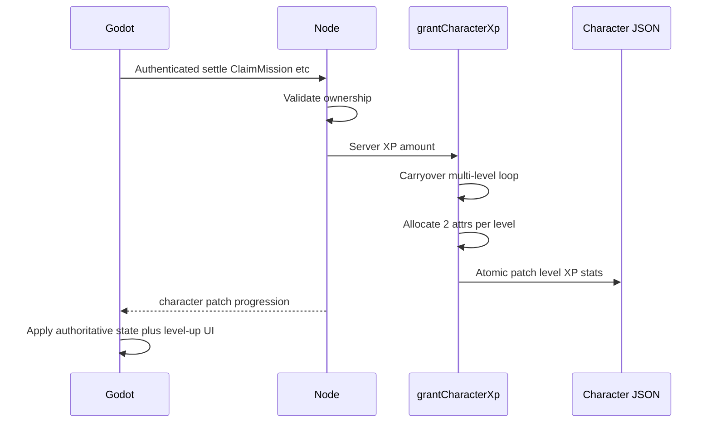
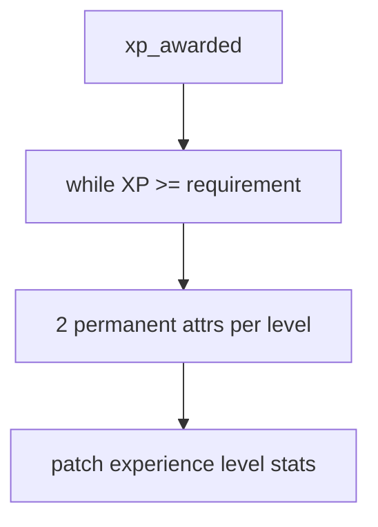

# Prompt 04 — Character Progression (XP, Levels, Free Attributes)

## 1. Existing authoritative progression

Node owned XP grants via duplicated level-up loops in:

- `server/src/shared/economyFormulas.js` → `applyXpToCharacter`
- `server/src/shared/rewards.js` → `applyCharacterRewards`
- `server/src/functions/index.js` admin currency adjust

Character stores `level`, `experience` (toward next), `experience_to_next_level`.
Client PATCH of those fields is blocked by `CHARACTER_ECONOMY_FIELDS`.

## 2. XP requirement implementation

Canonical closed form in [`server/src/shared/rewards.js`](../server/src/shared/rewards.js)
(mirrored in [`src/lib/gameData.js`](../src/lib/gameData.js)):

```
Base    = ROUND(1.35 × 2.106 × L^1.532 × (1 + (L/266)^3.683))
Post200Growth = 1 + A×X^P + B×X^Q , X = MAX(0,(L-200)/100)
units   = ROUND(Base × Post200Growth)
expForLevel = units × 10   // ×10 game scale applied AFTER rounding, as a final step
```

`expForLevel` is a single authoritative function (there is no separate pre-scale
`xpToNextBase`). The ×10 stays as an explicit final step because
`round(x) × 10 ≠ round(x × 10)`; folding it into the curve would change outputs.

## 3. `XP_REQUIREMENT_MULTIPLIER`

Applied **exactly once** inside `expForLevel` (`1.35`). Not applied again at exit.

## 4. Post-Level-200 fitted coefficients

**Recovered from live code** (not invented):

| Constant | Value |
|----------|-------|
| `POST_200_START_LEVEL` | 200 |
| `POST_200_A` | 0.8 |
| `POST_200_P` | 0.48 |
| `POST_200_B` | 0.79 |
| `POST_200_Q` | 0.71 |

Also documented in `server/scripts/fit-post200-xp-growth.mjs`.

## 5. Free-attribute allocation (restored)

Prior live design set `STAT_POINTS_PER_LEVEL = 0` (Stardust-only). Prompt 04 decision:
restore **2 permanent attrs per level**, server-random, class-weighted.

Implemented in [`server/src/shared/characterProgression.js`](../server/src/shared/characterProgression.js):

- 35% primary · 25% vitality · 20% luck · 10% / 10% remaining core offs
- Applied into `stats` (permanent), not `unspent_stat_points`
- Stardust `BuyAttribute` remains available

## 6. Class attribute mappings

| Class | Primary |
|-------|---------|
| Vanguard | strength |
| Astral Warden | strength |
| Shadow Operative | agility |
| Void Runner | agility |
| Technomancer | intellect |
| Cosmic Engineer | intellect |

## 7–10. Files / functions changed

### Node

- **Added** `server/src/shared/characterProgression.js` — `grantCharacterXp`, allocation, weights
- `economyFormulas.applyXpToCharacter` — wraps `grantCharacterXp`
- `rewards.applyCharacterRewards` — uses shared grant
- `economy.js` ClaimMission deliver — returns `progression`
- `economyFollowOn.js` arena + dungeon settle — returns `progression`
- `functions/index.js` admin XP — shared grant + `progression`

### Godot

- `CombatSheets.gd` — shows `attribute_awards`; reads `summary.progression`
- `arena_combat.gd` — passes `progression` into complete summaries

### Web

- `gameData.js` — `STAT_POINTS_PER_LEVEL = 2`
- `LevelUpOverlay.jsx` + Missions/Galaxy/Arena pages — display awards

### DB / migrations

- None (fields already exist)

## 11–12. Integrations / duplicates

- Mission / dungeon / arena / daily rewards / admin now share one grant path
- Removed parallel while-loops from rewards + admin (applyXpToCharacter is the wrapper)
- Historical Stardust-only comments superseded; BuyAttribute kept

## 13. Historical code retained

- XP/Fuel mission formulas unchanged
- Fit script / cadence sims retained
- `unspent_stat_points` field remains on Character but is not awarded by level-ups

## 14–16. Sources / idempotency / transactions

- Sources reconnect through `applyXpToCharacter` / `grantCharacterXp`
- Mission claim still uses existing reward claim keys / `idempotencyKey`
- Mutations stay inside existing `withTransactionAsync` boundaries; level + XP + stats written in one Character update

## 17–18. Tests

- `npm run test:progression` — PASS
- `npm run test:shared-foundation` — PASS
- `npm run test:entity-access` — PASS
- Godot `_audit_all.gd` — AUDIT_OK

## 19. Remaining debt

- Mission/dungeon/arena **XP amount** formulas not redesigned (out of scope)
- Web pages must forward `summary.progression` from settle APIs for award chips (overlay supports it)
- Timing targets (13–15d to L200, etc.) depend on reward sources restored later

## 20. Regression risks

- Existing characters gain free attrs on future level-ups (intentional design restore)
- Level-up power increases faster than the previous Stardust-only era
- `__progression` must be stripped before persist (handled via `consumeProgression`)

## 21–22. Diagrams




