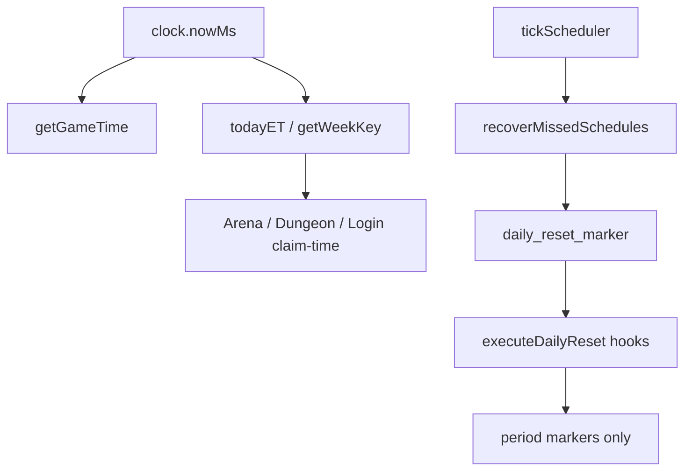
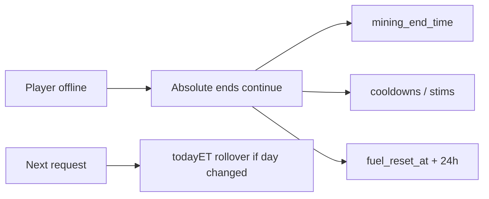

# Phase / Restoration 21 — Shared Scheduler, Daily/Weekly, Recurring Gameplay

Architecture: **Nakama = auth only.** Node owns the game clock, durable
schedules, and all period boundaries. Godot displays server-derived countdowns
only.

## Completion verdict

A shared ET clock and durable scheduler already existed. This restoration adds a
**façade** (`schedulerService.js`) — `getGameTime`, `executeDailyReset`,
`executeWeeklyReset`, `recoverMissedSchedules`, `serializeCooldown` — wires
midnight markers through it, switches fuel/stim helpers to `clock.nowMs()`, and
syncs Godot daily-reset ETAs from `/api/time/now`.

**Did not invent:** casino daily limits, statistics daily warehouses, daily
achievements, or Character wipe-at-midnight jobs (claim-time rollover remains
correct).

---

## Completion report

### 1. Existing scheduler architecture

| Layer | Location |
|-------|----------|
| Clock | `server/src/shared/time/clock.js` |
| Periods | `periods.js` — `todayET`, Monday ET week |
| Durable jobs | `scheduling/store.js` + `worker.js` (15s tick) |
| Handlers | `scheduling/handlers.js` |
| Façade (new) | `shared/schedulerService.js` |

### 2. Existing recurring systems

| System | Boundary | Mechanism |
|--------|----------|-----------|
| Fuel | Rolling 24h from `fuel_reset_at` | `checkFuelReset` (now clock-backed) |
| Arena free/rewarded | `todayET` | Claim/request-time |
| Dungeon lives | `todayET` | Claim/request-time |
| Daily login | `todayET` | `ClaimDailyLogin` |
| Shop windows | Absolute 12h ET anchors | `getShopWindow` |
| Weekly Nova | `getWeekKey` Monday ET | `ensureWeeklyNovaState` |
| Mining / mission / stim / cooldowns | Absolute UTC ends | Offline-safe by instant |
| Mail/entitlement/audit sweeps | Scheduled ET times | Worker |
| Casino daily limits | **Absent** | Not invented |
| Stats daily warehouse | **Absent** | Arena rewarded only |
| Achievement daily/weekly | **Absent** | Lifetime only |

### 3–5. Shared timing / day / week

- Zone: `America/New_York`
- Day: ET calendar date → `daily:na:YYYY-MM-DD`
- Week: Monday 00:00 ET
- Clients: `GET /api/time/now` + `GetGameTime` RPC

### 6–8. Files

**Node:** `schedulerService.js`, `handlers.js`, `routes/time.js`,
`economyFormulas.js` (clock hygiene), `functions/index.js` (`GetGameTime`),
`test-scheduler.mjs`.

**Godot:** `ProgressManager.gd` (server offset + reset ETA),
`ArenaRules.gd` (prefer server sync).

**DB:** none new (existing `schedules` / `schedule_occurrences`).

### 9. Tests

`npm run test:scheduler` — **10 passed**  
`npm run test:time` — **15 passed**

### 10. Diagrams

### 11. Regression

Scheduler + time suites green. Gameplay systems not rewritten — only clock
defaults and marker orchestration.

---

## Policy notes

1. **Midnight markers do not mass-reset Characters** — would race claim-time
   idempotency. Markers audit period IDs; gameplay rolls on next authenticated
   request.
2. **Fuel stays rolling 24h** (Prompt 15) — not forced to ET midnight.
3. **Missed resets:** `latest_only` catch-up on worker tick; occurrence IDs unique.
4. **Godot:** display from `nextDailyResetAtUtc` after `sync_server_time()`;
   never claims eligibility from local clock.
