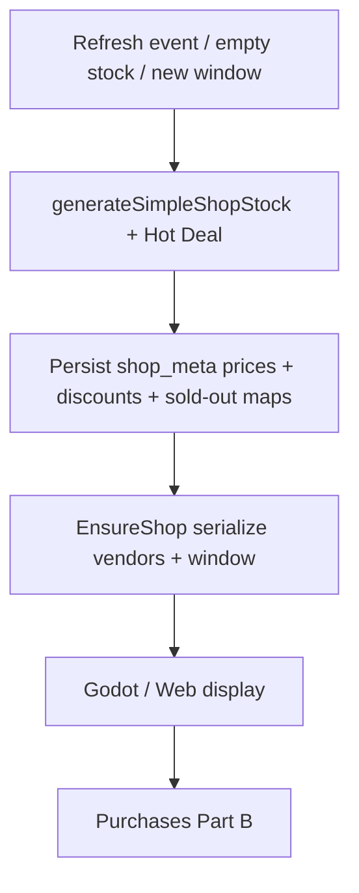

# Phase / Restoration 12A — Shop Architecture, Generation, Pricing, Refresh, Hot Deals & Haggling

> **HISTORICAL.** Live Black Market / Contraband Loot authority is Phase 6: `docs/PHASE6_BLACK_MARKET.md`. Do not restore 80/20, ET clocks, Hot Deal player-facing copy, or yank-on-haggle-fail from this document.

Architecture: Nakama owns auth/sessions. **Node owns all shop stock, pricing, RNG,
refresh, Hot Deal, and haggle rolls.** Godot requests and displays. Purchases are
wired to Node for reconnect but **Part B** owns full purchase-transaction audit.

## Completion report

### 1. Shop architecture recovered

**Authoritative system:** Node Black Market on `Character.shop_meta`, served by
`EnsureShop` / `RefreshShop` / `BuyShopGear` / `BuyShopConsumable` in
`server/src/functions/economy.js`, with generation in
`server/src/shared/economyFormulas.js`.

**Product model recovered (not redesigned):** one **unified Black Market** —
8 mixed stalls (80% gear / 20% stim, ≥1 stim) + separate **Hot Deal** spotlight.

Prompt 12A’s “two permanent vendors” are restored as **logical presentation
partitions** (`vendors.gear` / `vendors.supply`) over that same persistent stock
via `server/src/shared/shopService.js`. Separate generators were **not**
reintroduced (would redesign the recovered economy).

**Conflict reported:** live finalized code never had two independent vendor
inventories. Nakama Phase 15 (`modules/shops.lua`) was a divergent interim path
and is no longer used by Godot.

### 2. Inventory generation path

```
window_idx / manual_refresh_count
  → shopGearSeed
  → generateSimpleShopStock (8× gear|stim)
  → randomItem / GenerateGearItem (Prompt 07) for gear
  → randomConsumable + priceStimOffer for stims
  → generateSimpleHotDeal (day key, separate rarity/level tables)
  → persist Character.shop_meta
```

Generation runs only when stock is missing, window rotates, or manual refresh /
Hot Deal day roll requires it — **not** on UI reopen.

### 3. Refresh implementation

| Rule | Value |
|------|------:|
| Auto rotation | 12h windows at **02:00 / 14:00 America/New_York** |
| Free manual refresh | 1 per window |
| Paid refresh | **10 Nova** |
| Hot Deal day key | Resets **14:00 ET** |
| Hot Deal on manual refresh | Every **10** manual refreshes |

`RefreshShop` regenerates the 8 stalls; Hot Deal only when day rolls or every
10th manual refresh. Auto 12h rotation regenerates stalls but **keeps** Hot Deal
unless the day key rolled.

### 4. Persistence strategy

All state on `Character.shop_meta` (JSON entity field):

`window_idx`, `shop_stock` / `gear_stock` / `cons_stock`, `hot_deal`, `hot_day`,
`purchased`, `yanked`, `hot_purchased`, `hot_yanked`, `free_refresh_used`,
refresh counters.

Survives logout, reconnect, Node restart (SQLite entity store). No dedicated shop
tables.

### 5. Pricing strategy

| Offer | Formula |
|-------|---------|
| Gear | `ROUND(GearSaleValue × SHOP_RARITY_MARKUP × Uniform(0.8–1.2))` → persisted `cost` |
| Stim | `ROUND(StardustPerFuel(level) × {2,4,10})` by rarity |
| Legendary Nova surcharge | `computeNovaCrystalCost` → persisted `nova_cost` |

Serialization exposes `base_price`, `discount` (0 in recovered model),
`final_price`, `currency: stardust`. Variance is baked at generation; Godot never
recalculates.

**Hot Deal:** better rarity/level tables — **not** a separate persisted % off
listing (reported vs Prompt wording).

### 6. Hot Deal implementation

`generateSimpleHotDeal(dayKey, level, randomItemFn)` — Uncommon/Rare/Epic/Legendary
weights 35/45/15/5; item level gaps 0–3. Chosen at generation / day roll / every
10 refreshes. Sold-out via `hot_purchased` / `hot_yanked` until next Hot Deal.

### 7. Haggling implementation

`rollHaggle`: ~40% success → 15–20% off **that purchase**; failure **yanks**
listing (no regen). Does not mutate persisted `cost`. Does not reroll inventory.
Godot `ShopManager.buy_gear(..., haggle)` forwards to `BuyShopGear`.

### 8. Godot/GDScript files changed

- `loot&lasers/Autoload/ShopManager.gd` — Node EnsureShop/RefreshShop/BuyShop*; Hot Deal + sold-out helpers restored
- `loot&lasers/Scenes/UI/shop.gd` — server window countdown; real haggle path
- `loot&lasers/Scripts/GameData.gd` — comment: prefer Node window

### 9. Node files changed

- `server/src/shared/shopService.js` — **new** presentation / vendor partition
- `server/src/functions/economy.js` — EnsureShop/Refresh/Buy responses include presentation; restock comments fixed
- `server/scripts/test-shops.mjs` — **new**
- `package.json` — `test:shops`
- `src/lib/gameData.js` — legacy generators / client haggle marked `@deprecated`

### 10. Database changes

None. Existing `shop_meta` field reused.

### 11. Regression risks

- Godot players leave Nakama Phase 15 shop (different rarity/refresh/economy)
- Existing characters with Nakama-only shop docs are unused; Node regenerates from `shop_meta`
- Buy path is Node again (Part B will harden transaction/idempotency further)

### 12. Outstanding issues (Part B / design)

- Full purchase idempotency / wallet audit hardening (Part B)
- Prompt “two independent vendors” vs recovered unified Black Market — logical views only unless design mandates a split generator
- Hot Deal as “larger discount” vs recovered “better rarity spotlight”
- Gear name flavor may vary if stock were regenerated with identical seed; production relies on **persisted** stock
- Legacy `modules/shops.lua` still present — quarantine / disable later
- Web ShopPage already on Node; can optionally consume `vendors` payload

### Recovered constants

| Constant | Value |
|----------|------:|
| `SHOP_SLOT_COUNT` | 8 |
| `SHOP_GEAR_CHANCE` | 0.8 |
| `SHOP_STIM_CHANCE` | 0.2 |
| `SHOP_MIN_STIMS` | 1 |
| `SHOP_REFRESH_COST` | 10 Nova |
| `HOT_DEAL_REFRESH_COUNT` | 10 |
| Shop rarity | 60/30/8/1.5/0.5 % |
| Hot Deal rarity | 35/45/15/5 % (no Common) |
| Haggle | 40% → 15–20% off |

### Item level (shop gear)

Player level minus weighted gap; max gap grows with level (0 at L≤5 … 10 at L≥34).
Hot Deal gaps 0–3 only.

### Tests

```
npm run test:shops   → 13 passed
```

### Pipeline diagram



### Status

**12A complete** for architecture, generation, refresh, pricing serialization,
Hot Deal, haggle rules, and Godot→Node reconnect. Purchase settlement depth is
**Part B**.
