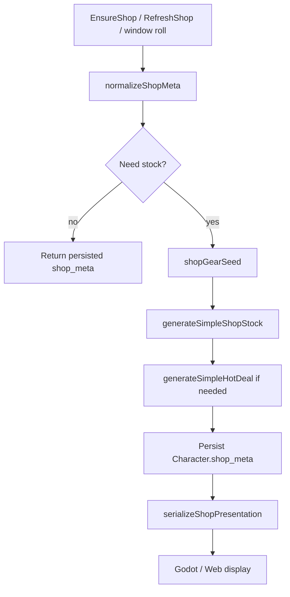
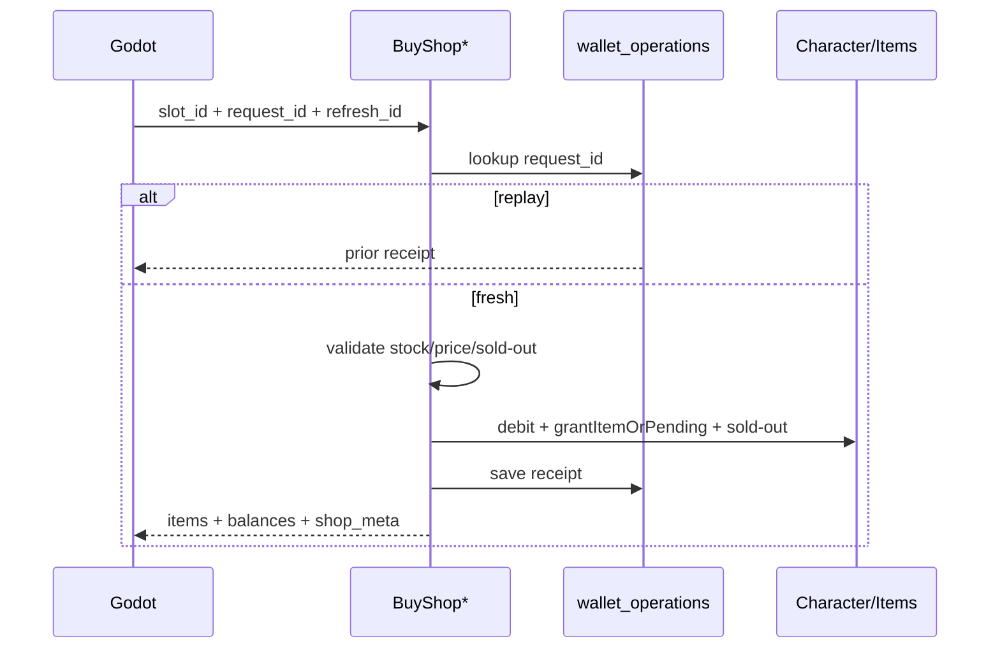
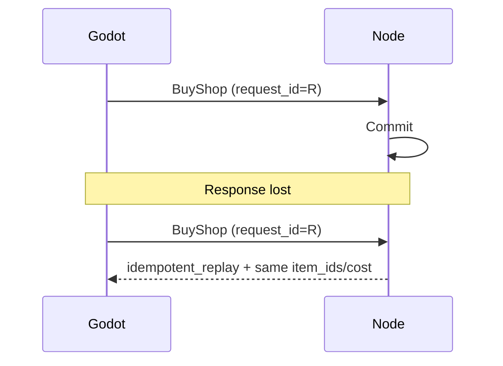
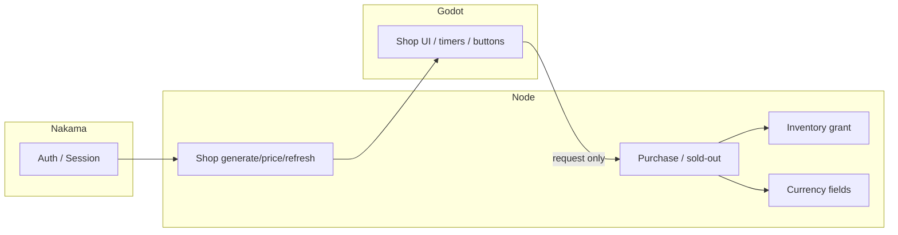

# Phase / Restoration 12C — Shop Final Integration, Regression Audit & Cleanup

> **HISTORICAL.** Live Market authority is Phase 6: `docs/PHASE6_BLACK_MARKET.md`.

Production-readiness audit of Restorations **12A** (architecture/generation) and
**12B** (purchasing). No new gameplay systems were added.

## Launch readiness: **READY** (with documented debt)

Shop authority is Node-only. Godot/web present only. Nakama shops are superseded.
Prior restorations (missions, combat, passives, inventory, gear, rewards) pass.

---

## Completion report

### 1. Shop architecture summary

One **Black Market** on `Character.shop_meta`:

| Layer | Owner |
|-------|--------|
| Generation / pricing / Hot Deal / refresh | Node `economyFormulas` + `EnsureShop` / `RefreshShop` |
| Purchase / sold-out / receipts | Node `BuyShopGear` / `BuyShopConsumable` + `wallet_operations` |
| Presentation vendors (gear/supply views) | Node `shopService.serializeShopPresentation` |
| UI | Godot `ShopManager` + `shop.gd`; web `ShopPage.jsx` |
| Auth | Nakama session → short-lived Node JWT |

Logical Gear/Supply vendor partitions are **views** over unified stock (12A conflict
resolution preserved).

### 2. Services restored (conceptual → live)

See `SHOP_AUTHORITY_MAP` in `server/src/shared/shopService.js`:

| Concept | Implementation |
|---------|----------------|
| GenerateShopInventory | `generateSimpleShopStock` + `EnsureShop` |
| GenerateGearInventory | `generateSimpleGearSlot` |
| GenerateStimInventory | stim slots inside `generateSimpleShopStock` |
| GenerateHotDeals | `generateSimpleHotDeal` |
| CalculateShopPrices | `gearShopPurchasePrice` / `stimShopPurchasePrice` / Nova surcharge |
| PurchaseShopItem | `BuyShopGear` / `BuyShopConsumable` |
| ValidatePurchase | `assertShopPurchaseClientSafe` + buy guards |
| RefreshInventory | `RefreshShop` + window `normalizeShopMeta` |
| SerializeInventory | `serializeShopPresentation` |
| RecoverPurchase | `wallet_operations` replay |

### 3. Services reused

- Gear: Prompt 07 `randomItem` / `GenerateGearItem`
- Inventory: Prompt 06 `grantItemOrPending`
- Economy: shared `StardustPerFuel` / sale markups
- Auth/JWT: existing gameplay pipeline
- Idempotency store: same `wallet_operations` pattern as `BuyFuel`

### 4. Duplicate implementations removed / isolated

| Artifact | Disposition |
|----------|-------------|
| `src/lib/gameData.js` `generateShopInventory` / `generateHotDeal` / `generateShopConsumableSlots` / client `normalizeShopMeta` / `shopGearSeed` / client `rollHaggle` | **Isolated** — throw stubs via `obsoleteShopClient` |
| `modules/shops.lua` | **Superseded** header; not Godot live path |
| `generateSimpleConsStock` / `generateSimpleGearStock` | Deprecated wrappers around unified stock (server) |
| Nakama Phase 15 docs | Marked superseded; point to 12A/12B/12C |

### 5. Persistence strategy

All durable shop state on Character JSON `shop_meta` + SQLite entity store.
Survives Node/Godot restart, logout, reconnect, JWT re-exchange (EnsureShop
reloads same `window_idx` stock).

### 6. Transaction strategy

Purchases run inside `withTransactionAsync` (`BEGIN IMMEDIATE`). Currency debit,
item grant, sold-out flags, and receipt write commit together or roll back.

### 7. Idempotency strategy

`request_id` → `wallet_operations` PK `(account_id, operation_type, operation_key)`.
Replay returns prior receipt without re-debit / re-grant. Sold-out maps block
alternate request ids for the same slot.

### 8. Recovery strategy

Timeout → retry same `request_id` → `idempotent_replay`.
Godot keeps `_pending_buy_request_id` until success.
Reopen shop → EnsureShop; no stock reroll within window.

### 9. Security findings

| Attack | Result |
|--------|--------|
| Client cost/price/balance | `SHOP_PRICE_TAMPER` 400 |
| Wrong refresh generation | `SHOP_GENERATION_MISMATCH` 409 |
| Expired/empty stock | `SHOP_STOCK_EXPIRED` 409 |
| Sold-out / yanked | `SHOP_SOLD_OUT` 409 |
| Wrong character | gameplayContext 4xx |
| Cross-account buy | no owned character / ownership fail |

No client authority on balances, prices, or inventory mutation observed in Godot
`ShopManager` (applies authoritative patch only).

### 10. Godot integration summary

- `ShopManager` → Node EnsureShop / RefreshShop / BuyShop*
- Sends `request_id` + `refresh_id`
- Displays Node `shop_window` countdown
- Haggle forwarded to Node
- No local stock/price/sold-out mutation

### 11. Node integration summary

- Economy handlers registered; presentation attached to Ensure/Refresh/Buy
- Inventory via shared grant path
- Audit `auditShopPurchase` on gear + stim buys

### 12. Database changes

None in 12C. Existing `wallet_operations` + Character entities.

### 13. Files modified (12C)

- `src/lib/gameData.js` — obsolete shop generators isolated (throw)
- `modules/shops.lua` — SUPERSEDED banner
- `server/src/shared/shopService.js` — `SHOP_AUTHORITY_MAP`
- `server/scripts/test-shop-stress.mjs` — **new**
- `scripts/verify_shop_service.mjs` — 12C checks
- `package.json` — `test:shop-stress`
- `docs/PHASE_SHOPS_12C.md` — this report

### 14. Automated test results

| Suite | Result |
|-------|--------|
| `test:shops` | 13 passed |
| `test:shop-purchases` | 11 passed |
| `test:shop-stress` | 9 passed |
| `verify_shop_service.mjs` | 29+ passed |

### 15. Stress test results

| Scenario | Result |
|----------|--------|
| 10,000 stock regenerations | OK (~370ms) |
| EnsureShop reopen identity | Identical slot ids / Hot Deal |
| Refresh clears sold-out | OK; stale slot rejected |
| 100,000 recovery lookups (10k full BuyShop replay + 90k PK reads) | OK; no double debit |
| Back-to-back same-slot buys (19 losers) | Exactly one success + 409s |
| Hot Deal day-key determinism | OK |

Note: `Promise.all` nested txns are unsupported on the shared SQLite connection;
race coverage uses serialized IMMEDIATE-equivalent back-to-back requests (same
invariants as production single-writer Node).

### 16. Regression results (Prompts 01–11 relevant)

| Suite | Result |
|-------|--------|
| `test:mission-rewards` | 12 passed |
| `test:combat` | 23 passed |
| `test:passives` | 27 passed |
| `test:inventory` | PASS |
| `test:gear-stats` | 14 passed |
| `test:attributes` | PASS |
| `test:rewards` | 10 passed |

### 17. Remaining technical debt

- `modules/shops.lua` still registered if Nakama loads it — disable RPC registration in deploy config when possible
- Full-bag purchase still charges → `pending_loot` (not reject-before-debit)
- No dedicated `shop_transactions` table (receipts live in `wallet_operations` + audit)
- Godot `GameData.get_shop_window` remains coarse UTC fallback if EnsureShop not yet loaded
- Multi-process SQLite write contention not load-tested beyond single Node process

### 18. Deferred improvements

- Optional physical split of Gear Vendor / Supply Vendor generators (design decision)
- Hot Deal as % discount vs rarity spotlight (design)
- Sell-to-vendor depth / shop sell RPC parity
- Multi-connection concurrency harness

### 19. Launch readiness assessment

**Shop subsystem is launch-ready** for Godot + web against Node:

- Single authority map
- Persistent stock / sold-out / Hot Deal
- Atomic, idempotent purchases
- Obsolete clients isolated
- Regressions green

---

## Diagrams

### Shop generation pipeline

### Refresh lifecycle

```mermaid
stateDiagram-v2
  [*] --> WindowActive: EnsureShop
  WindowActive --> WindowActive: Reopen UI / reconnect
  WindowActive --> ManualRefresh: RefreshShop
  ManualRefresh --> WindowActive: New stock + clear purchased/yanked
  WindowActive --> NewWindow: 12h ET rotate
  NewWindow --> WindowActive: New stock; Hot Deal kept unless day roll
```

### Purchase transaction

### Recovery flow

### Service ownership

---

## Status

**Restoration 12C complete.** Shop is integrated, audited, stress-checked, and
regression-clean relative to Prompts 01–11 surfaces exercised above.
