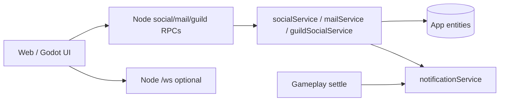

# Phase / Restoration 23 — Player Profiles and Social Systems

Architecture: **Nakama = auth / optional realtime transport only.**
**Node owns** profiles, friends, blocks, presence, chat persistence, mail, guild membership.
Clients (web + Godot) are presentation-only.

## Completion verdict

Social was a dual stack (Godot→Nakama friends/chat/mail; web→client entity CRUD).
Entity ACL tightenings had broken public Character/presence reads. This restoration
adds Node `socialService` / `mailService` / `guildSocialService`, locks social entity
writes, exposes RPCs, and points web + Godot managers at Node.

---

## Completion report

### 1. Profiles
`GetPublicProfile` + `serializePublicProfile` — name/class/level/avatar/title,
arena rating/rank, guild tag, presence, public achievements, public statistics
(no currency). Search via `SearchCharacters`.

### 2. Friends
Node `FriendRequest` / `Friendship` via `SendFriendRequest`, `AcceptFriendRequest`,
`DeclineFriendRequest`, `RemoveFriend`, `GetSocialState`. Self/dup/block checks
server-side. Notifications fan-out from service.

### 3. Chat
Existing `SendMessage` (global/private) kept. Added `GetChatHistory`,
`MarkConversationRead`. Entity create of chat messages locked. Guild chat still
**absent** (never finalized).

### 4. Mail
`GetInbox`, `SendMail`, `MarkMailRead`, `DeleteMail`, `RestoreMail`; claims still
`ClaimMailReward` → economy reward pipeline. System mail via `createSystemMail`
(server-only).

### 5. Guilds
**Exist.** Restored membership RPCs: `JoinGuild`, `LeaveGuild`, `InviteGuildMember`,
`AcceptGuildInvite`, `RequestJoinGuild`, `AcceptGuildRequest`, `KickGuildMember`,
`GetMyGuild`. `CreateGuild` / war declare unchanged. Guild XP/challenge client
contribution **deferred** (not invented progression).

### 6. Moderation
Existing `SendMessage` mute/spam + `AdminModeration` unchanged. Godot never mutes.

### 7–8. Realtime / Nakama
Node `/ws` entity subscribe kept. Nakama socket optional for Godot live events;
persistent social/mail/chat now Node. Legacy Nakama Lua social/mail modules not
deleted (transport/compat) but Godot managers no longer call them for authority.

### 9–10. Files
**Node:** `socialService.js`, `mailService.js`, `guildSocialService.js`,
`functions/index.js` RPCs, `entityAccess.js` locks.
**Web:** `socialEngine.js`, `mailEngine.js`, `chatEngine.js`, `guildUtils.js`,
`usePresence.jsx`.
**Godot:** `SocialManager.gd`, `ChatManager.gd`, `MailManager.gd`, `PresenceManager.gd`.

### 11. Database
No schema migration — reused existing entity tables.

### 12. Tests
`npm run test:social` — **10 passed**
Regression: notifications 8, entity-access (after ACL bool fix).

### 13. Architecture

### 14. Regression notes
- Client entity POST Friendship/Mail/Chat/GuildMember/Presence → **403**
- Mail rewards still go through ClaimMailReward (no bypass)
- Chat identity stamped from session character in SendMessage
- Friend duplicates / self-requests rejected server-side
- Guild kick permission: leader→non-leader, officer→member only

## Deferred / absent
- Guild chat channel
- Guild banks / progression / storage (never existed — not invented)
- Full migration off Nakama Lua modules (files remain; Godot unused for authority)
- Guild war resolve still partially client-sim (out of scope vs membership)
- Guild contributeMission XP still client Guild.update (documented gap)
