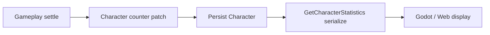
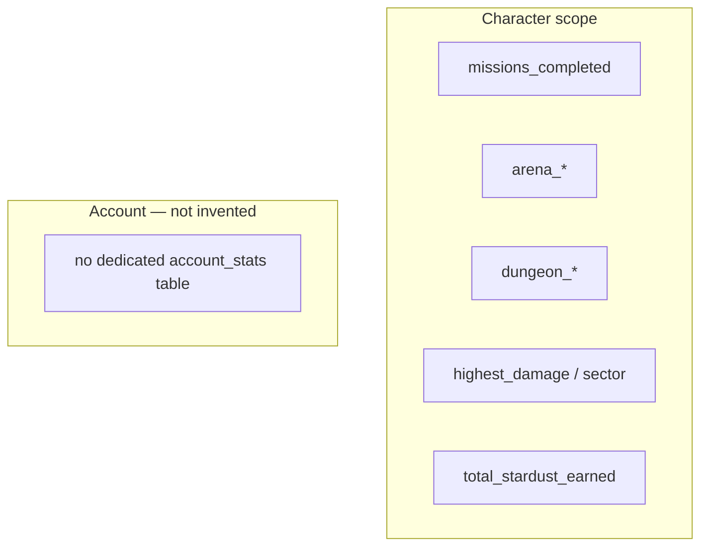
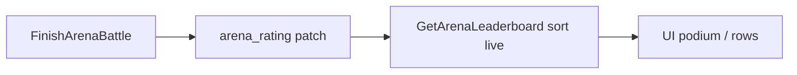
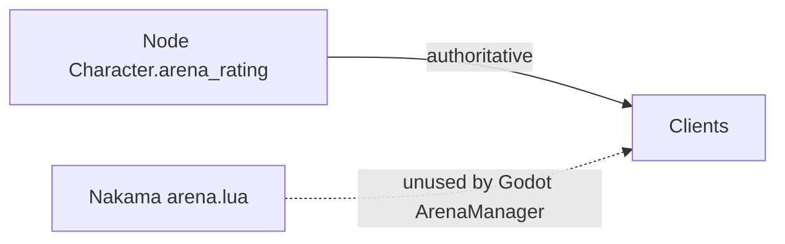
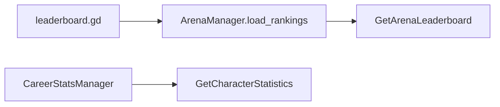

# Phase / Restoration 19 — Statistics, Records, Rankings, Leaderboards

Architecture: **Nakama = auth only.** Node owns Character career counters and
Arena ranking. Godot/web are presentation + read requests only. There is **no**
Nakama leaderboard score mirror in production use.

## Completion verdict

Restored a thin authoritative **read/serialize** layer over existing Character
settlement counters, wired Galactic Rankings UIs to `GetArenaLeaderboard`, and
added owner/public statistics RPCs. Did **not** invent a speculative event-bus
statistics warehouse, daily_stat tables, or non-Arena leaderboards.

---

## Completion report (prompt checklist)

### 1. Existing authoritative statistics architecture

Counters live on **Character** documents and are mutated only inside gameplay
settlement (missions, arena finish, dungeon finish, combat peak damage, ledger
credits to `total_stardust_earned`, etc.). No separate `statisticsService`
mutation path existed; Restoration 19 adds **read serialization** only.

### 2. Existing statistics definitions

Recovered registry in `STATISTIC_DEFINITIONS`
(`server/src/shared/statisticsService.js`): missions, arena W/L/battles/streak/
rating, dungeon clears/nodes, highest_sector, highest_damage,
total_stardust_earned, level, playtime_seconds (non-authoritative note).

### 3–4. Character / account models

- **Character-scoped:** all recovered career counters above.
- **Account-scoped:** none as separate tables. Slot/premium history remains
  entitlements — not invented as “account statistics.”

### 5. Daily / weekly models

- **Daily:** Arena rewarded wins via shared `todayET()` / `getArenaRewardedWinsState`
  (already Arena authority). No generic `daily_stats` table.
- **Weekly:** **absent** — not invented. Weekly Nova quests are separate.

### 6–8. Event processing / idempotency / personal records

- No async stats consumer. Idempotency = settlement wallet keys / once-claim
  paths from prior restorations.
- Personal records recovered from existing max fields: `highest_damage`,
  `arena_max_streak`, `highest_sector`. No separate personal_records table.
- No separate `highest_arena_rating` field — current `arena_rating` is Arena
  authority.

### 9–16. Domain statistics

| Domain | Status |
|--------|--------|
| Combat | `highest_damage` from combat settle; detailed attack/dodge/crit counters **not** persisted — gap reported |
| Mission | `missions_completed` (+ sector) via claim |
| Dungeon | `dungeon_clears`, `dungeon_nodes_cleared` |
| Arena | wins/losses/battles/streak/max_streak/rating + rewarded daily |
| Mining | no dedicated lifetime mining counters on Character — **gap** |
| Economy | `total_stardust_earned` (gross credits); current `stardust` separate |
| Item/Stim | collection array lengths only; no stim activation lifetime counter — **gap** |
| Casino | no lifetime wager counters on Character — **gap** |

### 17–20. Leaderboards

- **Boards:** `arena_rating` (Galactic Rankings) and `guild_level` (Guild Rankings).
- Character score = `arena_rating`; guild score = `Guild.level`.
- Guild ties: experience DESC → member_count DESC → created_date ASC → guild id ASC.
- Rank style: **ordinal row position** (1…N).
- `GetGuildLeaderboard` pages guilds server-side (`limit`/`offset`/`has_more`) and returns `your_guild` / `player_guild_rank` without requiring a relog (reads live Guild entities after XP/level mutations).

### 21. Tie / rank numbering

Sort: rating DESC → wins DESC → character_id ASC.  
Rank style: **ordinal row position** (1…N). Equal rating+wins still get distinct
ranks via id tie-break (not competition “1,2,2,4”).

### 22–23. Pagination / nearby

`serializeLeaderboardPage({ limit, offset })` — max page 100.  
`getNearbyArenaEntries(characterId, { radius })` — optional via
`GetArenaLeaderboard` `{ nearby: true }`.

### 24–26. Nakama sync / reconciliation

- Legacy `modules/arena.lua` rankings exist but Godot ArenaManager already uses
  Node. **`nakama_mirror: false`**.
- No Node→Nakama score sync path. Conflict policy if one is added later: **Node wins**.
- Rebuild-from-history: **not implemented** — no durable event stream of all
  counter sources; settle-once remains the model. Report gap honestly.

### 27–29. Rebuild / gaps / privacy

- Rebuild tooling deferred (would require fabricating history).
- Historical gaps: mining/casino/stim/combat-detail counters never stored.
- Public profile omits `stardust` / `total_stardust_earned`.

### 30–34. Files changed

**Node**

- `server/src/shared/statisticsService.js` (new)
- `server/src/shared/arenaService.js` (`id` + `created_by_id` on rank rows)
- `server/src/functions/economyFollowOn.js` — `GetCharacterStatistics`,
  `GetPublicProfileStatistics`, enhanced `GetArenaLeaderboard`
- `server/scripts/test-statistics.mjs` (new)
- `package.json` — `test:statistics`

**Godot**

- `loot&lasers/Autoload/CareerStatsManager.gd` (new)
- `loot&lasers/project.godot` — autoload
- `loot&lasers/Autoload/ArenaManager.gd` — pagination + nearby
- `loot&lasers/Scenes/UI/leaderboard.gd` — uses `GetArenaLeaderboard`

**Web**

- `src/pages/LeaderboardPage.jsx` — `GetArenaLeaderboard` instead of entity list sort

**Nakama / DB migrations:** none.

### 35–36. Removed / retained

- Removed client authoritative ladder sort as production path (UI still displays
  server-ordered rows).
- Retained Character counter mutation inside settlement handlers (not duplicated
  into a second write path).

### 37–40. Strategies

- **Transaction:** counters update with gameplay settle (existing).
- **Idempotency:** existing settle/claim keys — not a stats inbox.
- **Rebuild:** unsupported without event log — documented.
- **Caching:** none added; rank is live Character sort (acceptable for current DB size).

### 41. Security

- Client mutation keys on `GetCharacterStatistics` rejected.
- Client `arena_rating`/`rank` on leaderboard body stripped.
- Public stats hide currency.
- Rank rows expose account `created_by_id` for same-account challenge gate
  (already true for entity list).

### 42–45. Tests

`npm run test:statistics` — **14 passed**.

Coverage includes definitions, serialize private/public, ordering, pagination,
nearby, ties, RPCs, mutation reject, forge strip.

Stress/concurrency of a dedicated stats consumer: N/A (no consumer). Arena
settlement concurrency covered by prior Arena tests.

### 46. Regression

- `test:arena-authority` — 10 passed  
- `test:casino` — 12 passed  

### 47–49. Unsupported / deferred

- Weekly statistics tables  
- Mining / Casino / Stim lifetime counters  
- Detailed combat event counters  
- Event-driven rebuild  
- Nakama leaderboard mirror  
- Achievements (Prompt 20+) / Social visibility expansion (23) / Analytics (27)

### 50. Regression risks

- Leaderboard UI depends on `id` alias on rank rows (added).  
- CareerStatsManager autoload must remain registered.

---

## Diagrams

### Statistics event flow (recovered)



### Scope



### Leaderboard update



### Node / Nakama



### Rebuild

```
Not available — no durable multi-domain stats event log.
Idempotent settle remains the recovery model for individual counters.
```

### Godot load



---

## Manual validation notes

1. Open Galactic Rankings (web + Godot) — rows come from Node order.  
2. Complete Arena match — rating/wins update on Character; refresh board.  
3. Tamper local mission count — Node serialize ignores client body.  
4. Public profile stats — no Stardust earned/balance.
